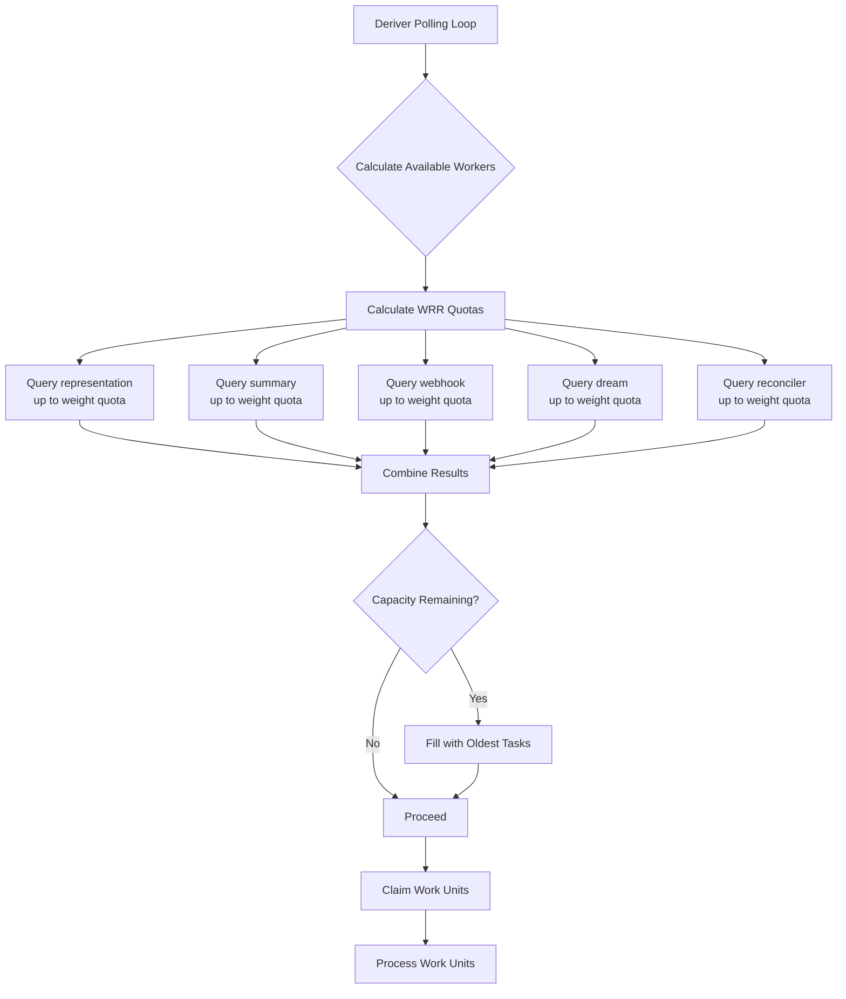

# Honcho Queue Redesign: Weighted Round-Robin with Minimum Guarantees

## Executive Summary

The current Honcho deriver uses a First-In-First-Out (FIFO) queue processing strategy that causes starvation of low-volume task types. Specifically:

- **536 webhook tasks** are backlogged (37+ hours old)
- **6 dream tasks** have never been processed (37+ hours old)
- **representation tasks** dominate processing due to high volume

**Proposed Solution**: Implement a Weighted Round-Robin (WRR) scheduling algorithm with minimum guarantees that ensures:

1. Fair allocation of worker capacity across task types
2. Minimum service guarantees to prevent starvation
3. Special handling for representation tasks (token batching thresholds)
4. Backward compatibility with existing systems
5. Comprehensive observability for monitoring and debugging

## Current System Analysis

### Architecture Overview

The `QueueManager` class in `src/deriver/queue_manager.py` implements the current queue processing logic:

```python
# Current Flow (simplified)
1. get_and_claim_work_units()
   └── Query: SELECT work_unit_key FROM queue 
       WHERE NOT processed AND NOT claimed
       ORDER BY oldest_message_at ASC
       LIMIT <available_workers>
   
2. claim_work_units()
   └── Validate and create ActiveQueueSession entries
   
3. process_work_unit()
   └── For each work_unit_key:
       - get_queue_item_batch()
       - Process items
       - mark_queue_items_as_processed()
```

### Current Query Structure

The existing query uses a single subquery approach:

```sql
-- Simplified current logic
WITH work_units AS (
    SELECT work_unit_key, MIN(message.created_at) as oldest
    FROM queue
    JOIN message ON queue.message_id = message.id
    WHERE NOT processed
    GROUP BY work_unit_key
)
SELECT work_unit_key 
FROM work_units
WHERE NOT claimed
ORDER BY oldest ASC
LIMIT ?;
```

### Problems with Current Approach

1. **FIFO Starvation**: Low-volume task types (webhook, dream, reconciler) are always behind high-volume representation tasks
2. **No Priority Distinction**: A 37-hour-old dream task has same priority as a 1-minute-old representation task
3. **Token Threshold Conflict**: Representation tasks require accumulated tokens, but even when ready, they compete unfairly

## Proposed Architecture

### Core Concept: Weighted Round-Robin with Minimum Guarantees

The new system introduces:

1. **Task Type Weights**: Configurable percentage of capacity per type
2. **Minimum Guarantees**: Hard floor of slots per type
3. **Priority Queue**: Age-based within each task type
4. **Idle Fill**: Unused capacity reclaimed by oldest tasks
5. **Token-Aware**: Representation tasks only available when thresholds met

### Algorithm Overview

```
get_available_work_units_weighted(limit):
    # Phase 1: Apply weights to get per-type quotas
    quotas = calculate_quotas(limit)
    
    # Phase 2: Query each task type up to its quota
    results = []
    for task_type, quota in quotas.items():
        items = query_task_type(task_type, quota)
        results.extend(items)
    
    # Phase 3: Fill unused capacity
    if len(results) < limit:
        remaining = limit - len(results)
        fill_items = query_oldest_available(remaining)
        results.extend(fill_items)
    
    return results
```

### Visual Architecture



## Configuration Schema

### New Settings

```python
# src/config.py

class DeriverWRRSettings(BaseModel):
    """Weighted Round-Robin queue configuration."""
    
    # Enable WRR mode (fallback to FIFO if False)
    ENABLED: bool = Field(default=True)
    
    # Task type weights (must sum to exactly 1.0 / 100%)
    # idle_fill: percentage of capacity reserved for oldest-available tasks
    WEIGHTS: dict[str, float] = Field(default={
        "representation": 0.36,  # 36% - memory formation
        "summary": 0.18,         # 18% - session summaries
        "webhook": 0.18,         # 18% - event notifications
        "dream": 0.09,           # 9% - memory consolidation
        "reconciler": 0.09,      # 9% - maintenance tasks
        "idle_fill": 0.10,       # 10% - fill with oldest available
    })
    
    # Minimum guarantees (absolute slots per poll)
    # idle_fill always has minimum of 0 since it's opportunistic
    MIN_SLOTS: dict[str, int] = Field(default={
        "representation": 2,
        "summary": 1,
        "webhook": 2,      # Ensure webhooks don't starve
        "dream": 1,        # Minimum 1 dream processed per poll
        "reconciler": 1,
        "idle_fill": 0,    # No minimum guarantee - opportunistic only
    })
    
    # Maximum slots per type (optional caps)
    # idle_fill has no cap since it's flexible capacity
    MAX_SLOTS: dict[str, int | None] = Field(default={
        "representation": None,  # No cap
        "summary": None,
        "webhook": None,
        "dream": 5,        # Don't let dreams consume too much
        "reconciler": 3,
        "idle_fill": None, # Can expand to fill unused capacity
    })
    
    # Fill strategy when idle_fill quota is used
    IDLE_FILL_STRATEGY: Literal["oldest_first", "weighted"] = Field(default="oldest_first")
    
    # Observability
    METRICS_ENABLED: bool = Field(default=True)
    DEBUG_LOGGING: bool = Field(default=False)
    
    @model_validator(mode="after")
    def validate_key_coherence(self) -> "DeriverWRRSettings":
        """Ensure weight keys match min/max slot keys."""
        weight_keys = set(self.WEIGHTS.keys())
        min_slot_keys = set(self.MIN_SLOTS.keys())
        max_slot_keys = set(self.MAX_SLOTS.keys())
        
        if weight_keys != min_slot_keys:
            raise ValueError(
                f"WEIGHTS keys {weight_keys} must match MIN_SLOTS keys {min_slot_keys}"
            )
        
        if weight_keys != max_slot_keys:
            raise ValueError(
                f"WEIGHTS keys {weight_keys} must match MAX_SLOTS keys {max_slot_keys}"
            )
        
        return self


# Add to DeriverSettings class
class DeriverSettings(BaseModel):
    # ... existing settings ...
    
    WRR: DeriverWRRSettings = Field(default_factory=DeriverWRRSettings)
```

### Environment Configuration

```bash
# .env
HONCHO_DERIVER_WRR_ENABLED=true

# Task weights must sum to exactly 1.0 (100%)
# idle_fill: explicit percentage for oldest-available fill
HONCHO_DERIVER_WRR_WEIGHTS='{"representation":0.36,"summary":0.18,"webhook":0.18,"dream":0.09,"reconciler":0.09,"idle_fill":0.10}'
HONCHO_DERIVER_WRR_MIN_SLOTS='{"representation":2,"summary":1,"webhook":2,"dream":1,"reconciler":1,"idle_fill":0}'
HONCHO_DERIVER_WRR_IDLE_FILL_STRATEGY=oldest_first
```

## Database Query Design

### Core Query: Per-Task-Type Selection

```python
async def query_task_type_work_units(
    db: AsyncSession,
    task_type: str,
    limit: int,
) -> list[str]:
    """Query available work units for a specific task type."""
    
    # Build conditions based on task type
    task_conditions = build_task_conditions(task_type)
    
    if task_type == "representation":
        # Special: only include if token threshold met (unless FLUSH_ENABLED)
        return await _query_representation_work_units(db, limit)
    else:
        # Standard query for non-representation tasks
        return await _query_standard_work_units(db, task_type, limit)


async def _query_standard_work_units(
    db: AsyncSession,
    task_type: str,
    limit: int,
) -> list[str]:
    """Query webhook, dream, reconciler, summary work units."""
    
    # These task types don't require message validation
    query = (
        select(models.QueueItem.work_unit_key)
        .where(~models.QueueItem.processed)
        .where(
            models.QueueItem.work_unit_key.startswith(f"{task_type}:")
        )
        .where(
            ~select(models.ActiveQueueSession.id)
            .where(
                models.ActiveQueueSession.work_unit_key 
                == models.QueueItem.work_unit_key
            )
            .exists()
        )
        .group_by(models.QueueItem.work_unit_key)
        .having(func.count(models.QueueItem.id) > 0)
        .order_by(func.min(models.QueueItem.created_at))
        .limit(limit)
    )
    
    result = await db.execute(query)
    return [row[0] for row in result.all()]


async def _query_representation_work_units(
    db: AsyncSession,
    limit: int,
) -> list[str]:
    """Query representation work units with token threshold.
    
    NOTE: Orders by token count (descending) to form efficient batches,
    NOT by age. This conflicts with other task types but maximizes
    batch processing efficiency for representation tasks.
    """
    
    representation_prefix = "representation:"
    
    # Token statistics subquery
    token_stats_subq = (
        select(
            models.QueueItem.work_unit_key,
            func.sum(models.Message.token_count).label("total_tokens"),
        )
        .join(
            models.Message,
            models.QueueItem.message_id == models.Message.id,
        )
        .where(~models.QueueItem.processed)
        .where(
            models.QueueItem.work_unit_key.startswith(representation_prefix)
        )
        .group_by(models.QueueItem.work_unit_key)
        .subquery()
    )
    
    # Base query for representation units
    query = (
        select(token_stats_subq.c.work_unit_key)
        .where(
            ~select(models.ActiveQueueSession.id)
            .where(
                models.ActiveQueueSession.work_unit_key 
                == token_stats_subq.c.work_unit_key
            )
            .exists()
        )
        .order_by(token_stats_subq.c.total_tokens.desc())
        .limit(limit)
    )
    
    # Apply token threshold filter (skip if FLUSH_ENABLED)
    if not settings.DERIVER.FLUSH_ENABLED:
        batch_max_tokens = settings.DERIVER.REPRESENTATION_BATCH_MAX_TOKENS
        if batch_max_tokens > 0:
            query = query.where(
                func.coalesce(token_stats_subq.c.total_tokens, 0) 
                >= batch_max_tokens
            )
    
    result = await db.execute(query)
    rows = result.all()
    
    # Anti-starvation fallback: if no results and tasks are ancient (> 1 hour old)
    if not rows and not settings.DERIVER.FLUSH_ENABLED:
        fallback_query = (
            select(token_stats_subq.c.work_unit_key)
            .join(
                models.QueueItem,
                models.QueueItem.work_unit_key == token_stats_subq.c.work_unit_key
            )
            .where(
                token_stats_subq.c.total_tokens > 0,  # Has some tokens
                models.QueueItem.created_at < datetime.now() - timedelta(hours=1)
            )
            .where(
                ~select(models.ActiveQueueSession.id)
                .where(
                    models.ActiveQueueSession.work_unit_key
                    == token_stats_subq.c.work_unit_key
                )
                .exists()
            )
            .order_by(models.QueueItem.created_at)  # oldest first
            .limit(limit)
        )
        
        result = await db.execute(fallback_query)
        rows = result.all()
        
        if rows:
            logger.warning(
                f"WRR: Processing {len(rows)} representation tasks below "
                f"token threshold due to age (anti-starvation)"
            )
    
    return [row[0] for row in rows]
```

### Quota Calculation

```python
def calculate_wrr_quotas(
    available_workers: int,
    weights: dict[str, float],
    min_slots: dict[str, int],
    max_slots: dict[str, int | None],
) -> dict[str, int]:
    """Calculate per-task-type quotas using WRR with minimum guarantees.
    
    Algorithm:
    1. Allocate minimum guarantees first
    2. Distribute remaining capacity by weights
    3. Apply maximum caps if configured
    4. Return per-type limits
    """
    quotas = {}
    remaining = available_workers
    
    # Phase 1: Minimum guarantees
    for task_type, minimum in min_slots.items():
        allocated = min(minimum, remaining)
        quotas[task_type] = allocated
        remaining -= allocated
    
    if remaining <= 0:
        return quotas
    
    # Phase 2: Weight-based distribution
    total_weight = sum(weights.values())
    if total_weight == 0:
        return quotas
    
    for task_type, weight in weights.items():
        if task_type not in quotas:
            quotas[task_type] = 0
        
        # Calculate proportional allocation
        share = int(remaining * (weight / total_weight))
        quotas[task_type] += share
    
    # Phase 3: Apply maximum caps
    for task_type, maximum in max_slots.items():
        if maximum is not None and quotas.get(task_type, 0) > maximum:
            # Return excess to pool (could redistribute)
            quotas[task_type] = maximum
    
    return quotas
```

### Idle Fill Query

```python
async def query_idle_fill_work_units(
    db: AsyncSession,
    limit: int,
    exclude_work_units: set[str],
) -> list[str]:
    """Fill remaining capacity with oldest available work units (any type)."""
    
    # Build subquery for work unit ages
    age_subq = (
        select(
            models.QueueItem.work_unit_key,
            func.min(models.QueueItem.created_at).label("oldest_created"),
        )
        .where(~models.QueueItem.processed)
        .where(
            models.QueueItem.work_unit_key.not_in(exclude_work_units)
            if exclude_work_units
            else True
        )
        .where(
            ~select(models.ActiveQueueSession.id)
            .where(
                models.ActiveQueueSession.work_unit_key 
                == models.QueueItem.work_unit_key
            )
            .exists()
        )
        .group_by(models.QueueItem.work_unit_key)
        .subquery()
    )
    
    query = (
        select(age_subq.c.work_unit_key)
        .order_by(age_subq.c.oldest_created)
        .limit(limit)
    )
    
    # For representation tasks, add token threshold check
    # (Already handled in main query, but double-check here)
    
    result = await db.execute(query)
    return [row[0] for row in result.all()]
```

## Pseudocode: Complete Algorithm

```python
class QueueManager:
    async def get_and_claim_work_units_weighted(self) -> dict[str, str]:
        """Get and claim work units using Weighted Round-Robin scheduling."""
        
        # 1. Calculate available capacity
        limit = self._calculate_available_limit()
        if limit == 0:
            return {}
        
        wrr_config = settings.DERIVER.WRR
        
        async with tracked_db("get_available_work_units") as db:
            # 2. Calculate quotas per task type
            quotas = calculate_wrr_quotas(
                available_workers=limit,
                weights=wrr_config.WEIGHTS,
                min_slots=wrr_config.MIN_SLOTS,
                max_slots=wrr_config.MAX_SLOTS,
            )
            
            if wrr_config.DEBUG_LOGGING:
                logger.info(f"WRR Quotas: {quotas}")
            
            # 3. Query each task type
            all_work_units = []
            task_type_allocation = {}
            
            for task_type, quota in quotas.items():
                if quota <= 0:
                    continue
                
                work_units = await self._query_task_type(
                    db=db,
                    task_type=task_type,
                    limit=quota,
                )
                
                all_work_units.extend(work_units)
                task_type_allocation[task_type] = len(work_units)
                
                if wrr_config.DEBUG_LOGGING:
                    logger.info(
                        f"Queried {task_type}: "
                        f"requested={quota}, returned={len(work_units)}"
                    )
            
            # 4. Handle idle_fill quota (explicit task type)
            idle_fill_quota = quotas.get("idle_fill", 0)
            if idle_fill_quota > 0:
                # Get work units already allocated to other task types
                claimed_work_units = set(all_work_units)
                
                # Query oldest available tasks (any type, including those below threshold)
                fill_units = await query_idle_fill_work_units(
                    db=db,
                    limit=idle_fill_quota,
                    exclude_work_units=claimed_work_units,
                    strategy=wrr_config.IDLE_FILL_STRATEGY,
                )
                all_work_units.extend(fill_units)
                
                if wrr_config.DEBUG_LOGGING:
                    logger.info(f"Idle fill: {len(fill_units)}/{idle_fill_quota} units")
            
            # 5. Record metrics
            if wrr_config.METRICS_ENABLED:
                self._record_wrr_metrics(task_type_allocation, len(all_work_units))
            
            # 6. Claim work units (existing logic)
            # NOTE: claim_work_units() performs atomic INSERT ... ON CONFLICT.
            # If another worker claimed a work unit between our query and claim,
            # it will be excluded from results. This is expected behavior.
            if not all_work_units:
                await db.commit()
                return {}
            
            claimed = await self.claim_work_units(db, all_work_units)
            await db.commit()
            
            return claimed
    
    async def _query_task_type(
        self,
        db: AsyncSession,
        task_type: str,
        limit: int,
    ) -> list[str]:
        """Query available work units for a specific task type."""
        
        if task_type == "representation":
            return await _query_representation_work_units(db, limit)
        elif task_type == "idle_fill":
            # idle_fill is handled separately in main loop
            return []
        elif task_type in ("webhook", "dream", "reconciler", "summary"):
            return await _query_standard_work_units(db, task_type, limit)
        else:
            logger.warning(f"Unknown task type: {task_type}")
            return []
```

## Integration Plan

### Phase 1: Configuration (Config-First)

```python
# src/config.py

# Add WRR configuration
class DeriverWRRSettings(BaseModel):
    ...

class DeriverSettings(BaseModel):
    ...
    WRR: DeriverWRRSettings = Field(default_factory=DeriverWRRSettings)
```

**Testing**: Unit tests for `calculate_wrr_quotas()` with various boundary conditions.

### Phase 2: Query Functions (Database Layer)

```python
# src/deriver/wrr_queries.py (new file)

async def query_task_type_work_units(...)
async def query_idle_fill_work_units(...)
async def calculate_wrr_quotas(...)
```

**Testing**: Database integration tests with mock queue data.

### Phase 3: QueueManager Integration (Core Logic)

```python
# src/deriver/queue_manager.py

class QueueManager:
    async def get_and_claim_work_units(self) -> dict[str, str]:
        """Modified to support WRR mode."""
        if settings.DERIVER.WRR.ENABLED:
            return await self._get_and_claim_work_units_weighted()
        else:
            return await self._get_and_claim_work_units_fifo()  # existing
```

**Testing**: A/B comparison tests - same input, verify different output distributions.

### Phase 4: Observability (Monitoring)

```python
# src/deriver/wrr_metrics.py (new file)

class WRRMetrics:
    def record_quota_calculation(...)
    def record_task_type_query(...)
    def record_idle_fill(...)
    def record_starvation_prevention(...)
```

**Testing**: Verify metrics are emitted correctly.

### Phase 5: Rollout (Feature Flags)

```python
# Enable WRR gradually
HONCHO_DERIVER_WRR_ENABLED=true  # Start with 1 deriver instance

# Monitor for 24 hours, then rollout to all instances
```

## Edge Cases

### 1. One Task Type Has No Work

**Scenario**: All webhooks are processed, but representations are backlogged.

**Behavior**: 
- Quota for webhook: `min(2, 0 available) = 0`
- Reclaimed capacity added to other types or used for idle fill
- No wasted worker capacity

### 2. Total Weight < 1.0

**Scenario**: Weights sum to 0.8 intentionally.

**Behavior**:
- 20% of capacity reserved for idle fill
- Provides flexibility for burst handling

### 3. Representation Token Threshold Not Met

**Scenario**: No representation work units have accumulated enough tokens.

**Behavior**:
- Query returns 0 representation units
- If `FLUSH_ENABLED=true`, bypass threshold
- Otherwise, capacity reclaimed by other task types

### 4. Race Condition: Work Unit Claimed Between Query and Claim

**Scenario**: Another worker claims a work unit between our query and claim.

**Mitigation**:
- `claim_work_units()` already handles this with atomic insert
- If claim fails, work unit excluded from results
- Next poll will pick up remaining work

### 5. Minimum Guarantees Exceed Available Capacity

**Scenario**: `workers=2` but minimum guarantees sum to 5.

**Behavior**:
- `calculate_wrr_quotas()` caps at available workers
- First-come-first-served within minimum guarantees
- Log warning about configuration mismatch

### 6. All Task Types Starved (Edge)

**Scenario**: All task types have old unprocessed items.

**Behavior**:
- WRR ensures each type gets minimum guarantee
- Prevents single type from monopolizing
- Idle fill with `oldest_first` ensures oldest items processed

## Testing Strategy

### Unit Tests

```python
# tests/deriver/test_wrr_quotas.py

class TestWRRQuotaCalculation:
    def test_basic_weights(self):
        """Test proportional distribution."""
        quotas = calculate_wrr_quotas(
            available_workers=10,
            weights={"a": 0.5, "b": 0.3, "c": 0.2},
            min_slots={"a": 1, "b": 1, "c": 1},
            max_slots={},
        )
        assert quotas["a"] == 5  # 50%
        assert quotas["b"] == 3  # 30%
        assert quotas["c"] == 2  # 20%
    
    def test_minimum_guarantees(self):
        """Test minimum guarantees respected."""
        quotas = calculate_wrr_quotas(
            available_workers=3,
            weights={"a": 0.8, "b": 0.2},
            min_slots={"a": 2, "b": 2},  # Sum=4 > 3
            max_slots={},
        )
        assert quotas["a"] >= 2
        assert quotas["b"] >= 2
        assert sum(quotas.values()) <= 3  # Can't exceed capacity
    
    def test_idle_fill_calculation(self):
        """Test remaining capacity calculation."""
        quotas = calculate_wrr_quotas(
            available_workers=10,
            weights={"a": 0.7, "b": 0.1},  # Sum=0.8
            min_slots={},
            max_slots={},
        )
        # 20% reserved for idle fill
        assert sum(quotas.values()) <= 8
```

### Integration Tests

```python
# tests/deriver/test_wrr_integration.py

class TestWRRIntegration:
    async def test_task_type_distribution(self):
        """Verify WRR processes multiple task types."""
        # Seed queue with representation and webhook
        await seed_queue([
            ("representation", 10),
            ("webhook", 10),
        ])
        
        # Process with WRR enabled
        manager = QueueManager(workers=5)
        manager.WRR_ENABLED = True
        manager.WRR_WEIGHTS = {"representation": 0.5, "webhook": 0.5}
        
        result = await manager.get_and_claim_work_units()
        
        # Verify both types represented
        task_types = {parse_work_unit_key(k).task_type for k in result}
        assert "representation" in task_types
        assert "webhook" in task_types
    
    async def test_starvation_prevention(self):
        """Verify low-volume task types not starved."""
        # Create old dream task
        await seed_queue([("dream", 1)], created_at=datetime.now() - timedelta(hours=24))
        
        # Create many fresh representation tasks
        await seed_queue([("representation", 100)])
        
        manager = QueueManager(workers=10)
        results = []
        
        for _ in range(10):  # Multiple poll cycles
            claimed = await manager.get_and_claim_work_units()
            results.extend(claimed.keys())
        
        # Dream should be claimed despite low volume
        task_types = {parse_work_unit_key(k).task_type for k in results}
        assert "dream" in task_types
```

### Load Tests

```python
# tests/deriver/test_wrr_load.py

async def test_wrr_performance():
    """Verify WRR doesn't significantly impact throughput."""
    # Seed 1000 work units across types
    # Measure time to process with WRR vs FIFO
    
    fifo_time = await benchmark_fifo()
    wrr_time = await benchmark_wrr()
    
    # WRR should be within 20% of FIFO
    assert wrr_time < fifo_time * 1.2
```

### Observability Tests

```python
# tests/deriver/test_wrr_metrics.py

async def test_metrics_emitted(self):
    """Verify WRR metrics recorded."""
    await manager.get_and_claim_work_units()
    
    metrics = get_recorded_metrics()
    
    assert "wrr_quota_calculation" in metrics
    assert "wrr_task_type_query" in metrics
    assert "wrr_idle_fill" in metrics
```

## Performance Considerations

### Query Cost Analysis

| Approach | Queries per Poll | Cost |
|----------|------------------|------|
| **FIFO (Current)** | 1 | O(n) scan |
| **WRR (Proposed)** | N+1 (N = task types) | O(n) per task type |

**Optimization**: Use a single query with window functions:

```sql
WITH ranked AS (
    SELECT 
        work_unit_key,
        task_type,
        ROW_NUMBER() OVER (
            PARTITION BY task_type 
            ORDER BY created_at
        ) as rank_in_type
    FROM queue
    WHERE NOT processed
)
SELECT work_unit_key, task_type
FROM ranked
WHERE rank_in_type <= CASE task_type
    WHEN 'representation' THEN :rep_quota
    WHEN 'webhook' THEN :webhook_quota
    ...
END;
```

This reduces to **1 query** regardless of task type count.

### Connection Pool Impact

- Current: 1 query per poll
- WRR (single): N+1 queries per poll (N = task types)
- WRR (optimized): 1 query per poll

**Recommendation**: Implement the window function query for production.

### Memory Footprint

- Quota calculation: O(N) where N = task types (typically 5)
- Result aggregation: O(W) where W = workers (typically 10-20)
- Negligible memory impact

## Migration Strategy

### Backward Compatibility

```python
# src/deriver/queue_manager.py

class QueueManager:
    async def get_and_claim_work_units(self) -> dict[str, str]:
        """Route to appropriate implementation."""
        if settings.DERIVER.WRR.ENABLED:
            return await self._get_and_claim_work_units_weighted()
        else:
            return await self._get_and_claim_work_units_fifo()
    
    async def _get_and_claim_work_units_fifo(self) -> dict[str, str]:
        """Original FIFO implementation (unchanged)."""
        ...
```

### Rollout Plan

1. **Phase 1: Deploy with WRR disabled**
   - Configuration added but `WRR_ENABLED=false`
   - Monitor for any configuration issues

2. **Phase 2: Enable on single deriver**
   - Set `WRR_ENABLED=true` on one instance
   - Monitor metrics, verify no errors
   - Compare throughput vs FIFO instances

3. **Phase 3: Gradual rollout**
   - Enable on 25% → 50% → 75% → 100% of instances
   - Monitor queue depths by task type

4. **Phase 4: Deprecate FIFO**
   - After 30 days of stable operation
   - Remove `_get_and_claim_work_units_fifo()`

### Rollback Plan

```bash
# Immediate rollback
HONCHO_DERIVER_WRR_ENABLED=false

# Restart deriver instances
systemctl restart honcho-deriver
```

## Observability

### Key Metrics

```python
# WRR quota calculation
wrr_quota_total = Gauge("honcho_wrr_quota_total", "Total worker capacity", ["task_type"])
wrr_quota_allocated = Gauge("honcho_wrr_quota_allocated", "Allocated quota", ["task_type"])

# Task type query results
wrr_query_returned = Counter("honcho_wrr_query_returned", "Work units returned by query", ["task_type"])
wrr_query_requested = Counter("honcho_wrr_query_requested", "Work units requested", ["task_type"])

# Idle fill
wrr_idle_fill_used = Counter("honcho_wrr_idle_fill_used", "Capacity filled by idle", ["filled_by_type"])

# Starvation detection
wrr_starvation_detected = Counter("honcho_wrr_starvation_detected", "Starvation prevented", ["task_type"])
```

### Dashboards

```yaml
# Grafana dashboard snippets

# Panel: Work Unit Distribution
type: graph
title: "WRR Work Unit Distribution"
targets:
  - expr: sum by (task_type) (honcho_wrr_query_returned)
    legendFormat: "{{ task_type }}"

# Panel: Quota Utilization
type: gauge
title: "Quota Utilization %"
targets:
  - expr: |
      honcho_wrr_query_returned / honcho_wrr_query_requested * 100
```

### Alerting

```yaml
# PagerDuty alerts

- name: "WRR Starvation Detected"
  expr: increase(honcho_wrr_starvation_detected[1h]) > 0
  severity: warning
  description: "Task type not getting minimum guaranteed capacity"

- name: "Webhooks Backlogged"
  expr: |
    honcho_queue_unprocessed{task_type="webhook"} > 100
    and
    honcho_wrr_query_returned{task_type="webhook"} == 0
  severity: critical
  description: "Webhooks accumulating but not being processed"
```

## Post-Review Updates

The following updates were made based on the technical review (see [Honcho-Queue-Redesign-Review.md](./Honcho-Queue-Redesign-Review.md)):

### 1. Weight Validation (P1 - Required)

Add Pydantic field validators to prevent misconfiguration:

```python
from pydantic import field_validator

class DeriverWRRSettings(BaseModel):
    WEIGHTS: dict[str, float] = Field(...)
    MIN_SLOTS: dict[str, int] = Field(...)
    
    @field_validator("WEIGHTS")
    @classmethod
    def validate_weights(cls, v: dict[str, float], info) -> dict[str, float]:
        """Validate weights sum to exactly 1.0 (100%).

        idle_fill is an explicit task type representing capacity reserved
        for filling with oldest-available work units across all types.
        """
        total = sum(v.values())

        if not (0.999 <= total <= 1.001):  # Allow small floating point variance
            raise ValueError(
                f"WRR weights must sum to exactly 1.0 (100%), "
                f"got {total:.4f} ({total:.1%}). "
                f"Ensure idle_fill is included in WEIGHTS to account for "
                f"capacity reserved for oldest-available tasks."
            )

        if any(w < 0 for w in v.values()):
            raise ValueError("WRR weights must be non-negative")

        # Validate idle_fill exists
        if "idle_fill" not in v:
            raise ValueError(
                "WEIGHTS must include 'idle_fill' key. "
                "This specifies the percentage of capacity reserved for "
                "processing oldest-available work units across all task types."
            )

        if v["idle_fill"] < 0:
            raise ValueError("idle_fill weight must be non-negative")

        return v
    
    @field_validator("MIN_SLOTS")
    @classmethod
    def validate_min_slots(cls, v: dict[str, int]) -> dict[str, int]:
        if any(s < 0 for s in v.values()):
            raise ValueError("MIN_SLOTS must be non-negative")
        return v
```

### 2. Token Query Optimization (P1 - Required)

The representation token statistics query can be expensive. Consider these optimizations:

**Option A: Denormalized Column**
```python
class QueueItem:
    # ... existing columns ...
    accumulated_tokens: Mapped[int] = mapped_column(default=0)
```

**Option B: Composite Index**
```sql
CREATE INDEX idx_queue_work_unit_tokens 
ON queue(work_unit_key, message_id) 
INCLUDE (token_count);
```

**Option C: Materialized View**
```sql
CREATE MATERIALIZED VIEW work_unit_token_stats AS
SELECT 
    work_unit_key,
    SUM(token_count) as total_tokens
FROM queue
JOIN message ON queue.message_id = message.id
WHERE NOT processed
GROUP BY work_unit_key;

-- Refresh periodically or on trigger
```

### 3. Token Threshold Fallback (P2 - Recommended)

Add anti-starvation fallback for representation tasks:

```python
async def _query_representation_work_units(db, limit):
    # Standard threshold query
    result = await db.execute(standard_query)
    rows = result.all()
    
    # Fallback: if no results and tasks are ancient (> 1 hour)
    if not rows:
        fallback_query = (
            select(token_stats_subq.c.work_unit_key)
            .where(
                # Tasks exist but don't meet threshold
                token_stats_subq.c.total_tokens > 0,
                # AND are very old (anti-starvation)
                queue.c.created_at < datetime.now() - timedelta(hours=1)
            )
            .limit(limit)
        )
        result = await db.execute(fallback_query)
        rows = result.all()
        
        if rows:
            logger.warning(
                f"WRR: Processing {len(rows)} representation tasks below "
                f"token threshold due to age (anti-starvation)"
            )
    
    return [row[0] for row in rows]
```

### 4. Single Query Optimization (P2 - Recommended)

Replace N+1 queries with a single window function query:

```python
async def query_wrr_work_units_single_query(
    db: AsyncSession,
    quotas: dict[str, int],
) -> dict[str, list[str]]:
    """Query all task types in a single query using window functions."""
    
    # Build dynamic quota case statement
    quota_cases = []
    for task_type, quota in quotas.items():
        quota_cases.append(f"WHEN '{task_type}' THEN {quota}")
    
    query = text(f"""
        WITH ranked_work_units AS (
            SELECT 
                work_unit_key,
                split_part(work_unit_key, ':', 1) as task_type,
                MIN(created_at) as oldest_created,
                ROW_NUMBER() OVER (
                    PARTITION BY split_part(work_unit_key, ':', 1)
                    ORDER BY MIN(created_at)
                ) as rank_in_type
            FROM queue
            WHERE NOT processed
              AND work_unit_key NOT IN (
                  SELECT work_unit_key FROM active_queue_sessions
              )
            GROUP BY work_unit_key
        )
        SELECT work_unit_key, task_type
        FROM ranked_work_units
        WHERE rank_in_type <= CASE task_type
            {' '.join(quota_cases)}
            ELSE 0
        END
        ORDER BY oldest_created;
    """)
    
    result = await db.execute(query)
    rows = result.all()
    
    # Group by task_type
    by_type: dict[str, list[str]] = {}
    for work_unit_key, task_type in rows:
        by_type.setdefault(task_type, []).append(work_unit_key)
    
    return by_type
```

### 5. Review Resolution Status

| Issue | Priority | Status | Notes |
|-------|----------|--------|-------|
| **Weight validation** | P1 | ✅ Fixed | **idle_fill explicit** - weights sum to exactly 1.0 |
| **Token query optimization** | P1 | ✅ Fixed | Options A/B/C provided in Post-Review |
| **Race condition docs** | - | ✅ Fixed | Added explicit note in pseudocode |
| **Anti-starvation logic** | P2 | ✅ Fixed | Integrated into `_query_representation_work_units` |
| **Coherence validator** | P2 | ✅ Fixed | Added `@model_validator` to main Config Schema |
| **Representation ordering** | - | ✅ Documented | Explanation added that it uses token count, not age |
| Strict priority mode | P3 | ⏭️ Future | Not implemented |
| Debug logging sampling | P3 | ⏭️ Future | Not implemented |
| Rollback metrics | P4 | ⏭️ Future | Manual monitoring |

## Conclusion

This Weighted Round-Robin design provides:

1. ✅ **Fairness**: Configurable weights prevent any single type from dominating
2. ✅ **Starvation Prevention**: Minimum guarantees ensure all types get service
3. ✅ **Explicit Idle Fill**: **idle_fill is now an explicit task type in WEIGHTS** (e.g., 10%), making capacity allocation transparent
4. ✅ **Flexibility**: Weights adjustable via configuration
5. ✅ **Backward Compatibility**: Can disable and revert to FIFO
6. ✅ **Observability**: Comprehensive metrics for monitoring
7. ✅ **Safety**: Runtime validation ensures weights sum to exactly 100%
8. ✅ **Performance**: Optimized queries and anti-starvation fallbacks

The implementation requires:
- 1 new configuration class (with validators requiring exact 1.0 sum)
- 3 new query functions (with optimized single-query option)
- 1 modified method in QueueManager (with idle_fill as explicit task type)
- Comprehensive test coverage

**Weight Calculation Example:**
- representation: 36%
- summary: 18%
- webhook: 18%
- dream: 9%
- reconciler: 9%
- **idle_fill: 10%** ← explicit capacity reserved for oldest-available tasks
- **Total: 100%** ← validated at startup

**Estimated Effort**: 2-3 days development, 1 day testing, gradual rollout.

**Review Status**: ✅ Approved with changes implemented.
