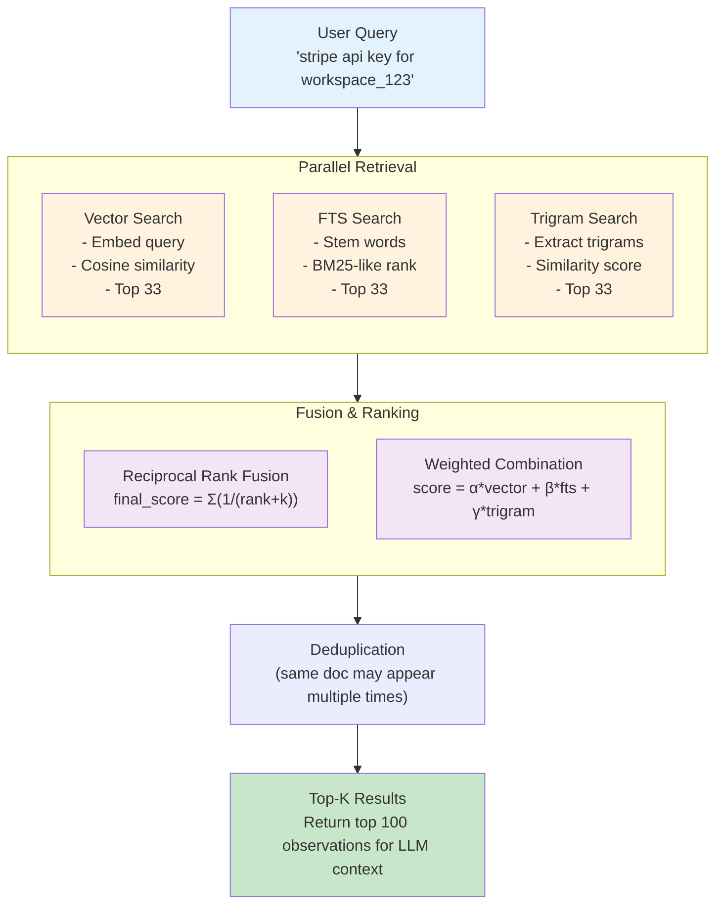
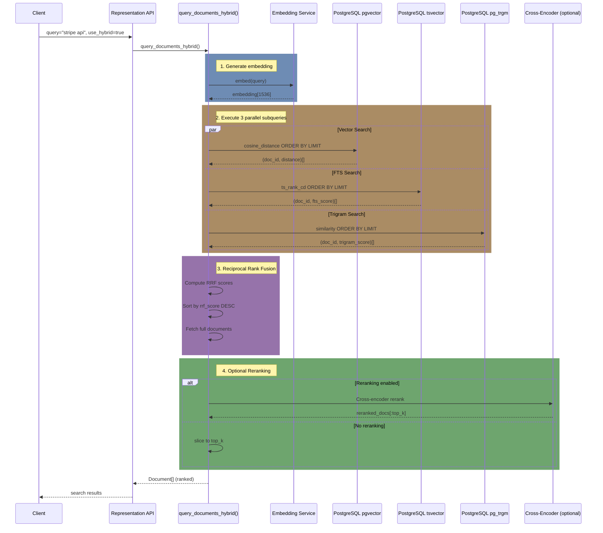
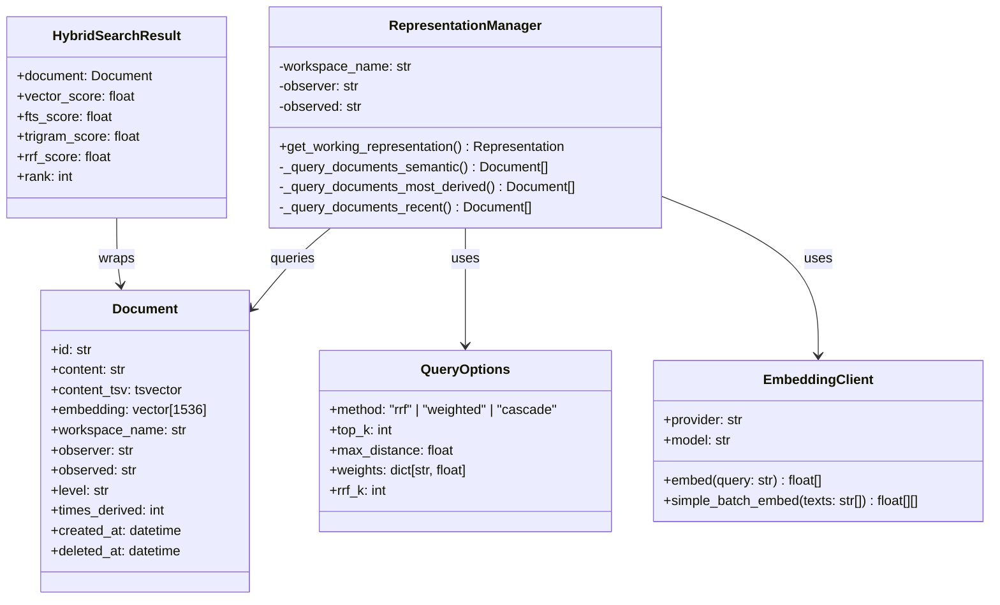
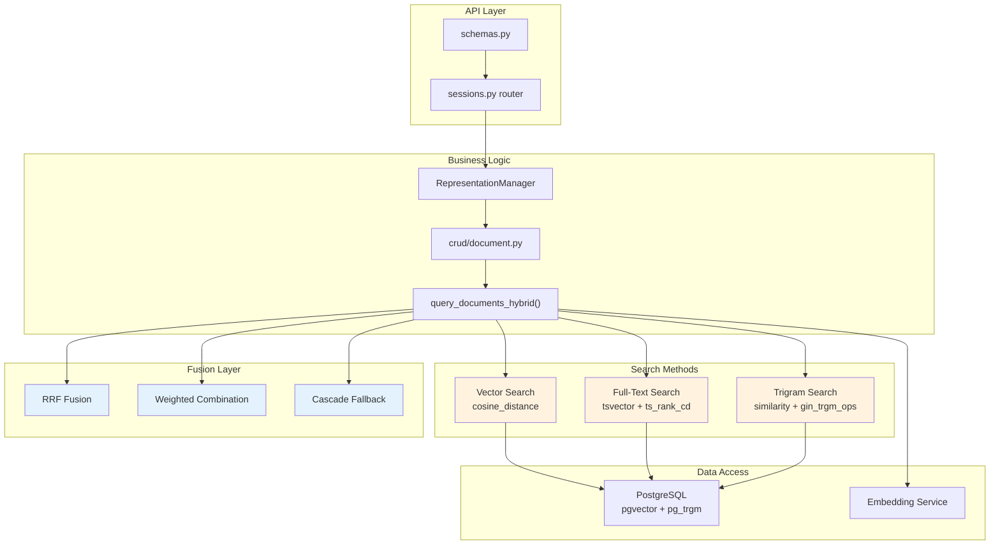
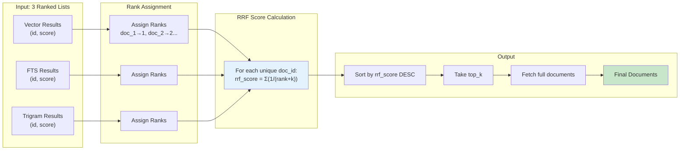
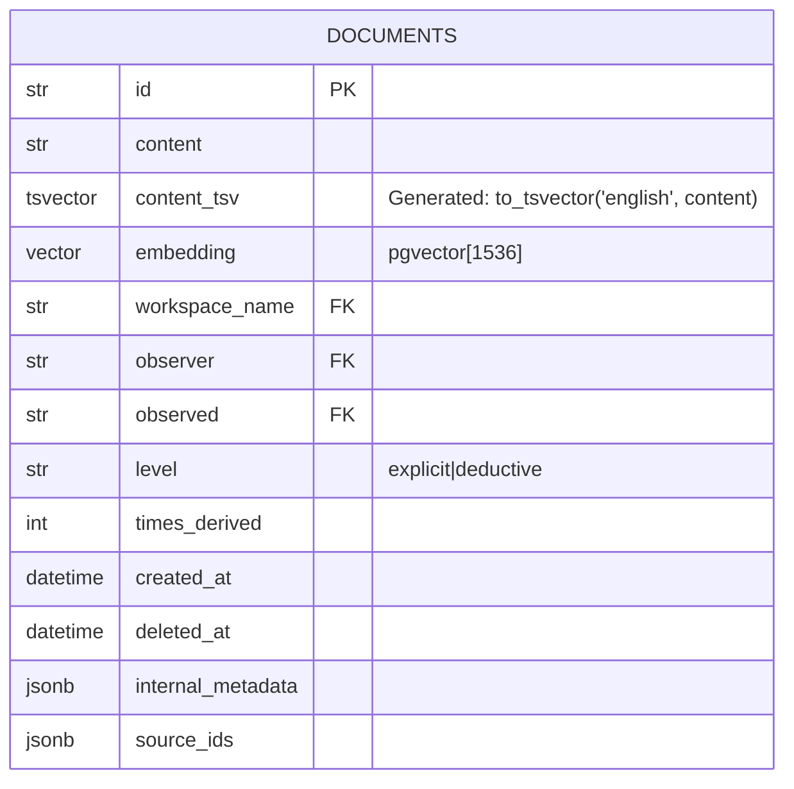

# Honcho Hybrid Search: Vector + FTS + Trigram Reranking

A guide to enhancing Honcho's memory retrieval by combining semantic vector search with PostgreSQL full-text search (BM25-like) and trigram fuzzy matching.

## Overview

Honcho's default retrieval uses **purely semantic vector search** via pgvector. While effective for conceptual queries, this approach has limitations for exact term matching, proper nouns, and technical identifiers. This guide describes how to use the hybrid search implementation that augments vector search with:

1. **Full-Text Search (FTS)** - BM25-like keyword matching using PostgreSQL's built-in `tsvector`
2. **Trigram Fuzzy Search** - Typo-tolerant matching via `pg_trgm` extension
3. **Cross-Encoder Reranking** - Optional reranking for improved relevance (when enabled)

**Status**: ✅ **Implemented** - Hybrid search is production-ready with database migration.

**Database Migration Required**: `adb68784e753_add_hybrid_search_support.py`

---

## Problem Statement

### Current Limitations (Vector-Only Search)

| Issue | Example Query | Failure Mode |
|-------|---------------|--------------|
| **Exact term matching** | "API key for Stripe" | May miss documents with "API_key" or "apikey" |
| **Proper nouns / IDs** | "workspace_abc123" | Vectors dilute signal for unique tokens |
| **Technical terms** | "webhook endpoint URL" | Embeddings may not capture exact terminology |
| **Typos** | "stripe integraiton" | No match if document has correct spelling |
| **Rare terms** | "idempotency key" | Common embeddings underweight rare but important terms |

### Why Hybrid Search Helps

Human memory queries often combine:
- **Semantic intent** ("what did they think about X?")
- **Specific keywords** (names, dates, technical terms)
- **Imprecise recall** (typos, partial memories)

A hybrid approach leverages the strengths of each method:

| Method | Strengths | Weaknesses |
|--------|-----------|------------|
| **Vector (pgvector)** | Semantic similarity, paraphrase matching | Poor on exact terms, IDs, rare words |
| **FTS (tsvector)** | Exact keyword matching, stemming, fast | No semantic understanding, rigid matching |
| **Trigram (pg_trgm)** | Typo tolerance, partial matches | Slower, less precise ranking |

---

## Architecture

### Search Pipeline



---

## Implementation Details

### Source Files

| File | Purpose | Key Functions |
|------|---------|---------------|
| `src/crud/document.py` | Document CRUD operations | `query_documents_hybrid()`, `_hybrid_rrf()`, `_hybrid_weighted()`, `_hybrid_cascade()` |
| `src/crud/representation.py` | Representation manager | `_query_documents_semantic()` with `use_hybrid` parameter |
| `src/utils/search.py` | Search utilities | `search()`, `reciprocal_rank_fusion()`, `_semantic_search()`, `_fulltext_search()` |
| `src/config.py` | Settings | `HybridSearchSettings`, `RerankerSettings` classes |
| `src/reranker_client.py` | Cross-encoder reranking | `rerank_documents()` |
| `migrations/versions/adb68784e753_*.py` | Database migration | Adds `content_tsv`, `pg_trgm`, indexes |

### Fusion Methods

#### 1. Reciprocal Rank Fusion (RRF) - Default

Combines ranked lists from all three search methods:

```python
RRF_score = Σ(1 / (k + rank)) for each list where doc appears
```

- **Pros**: Robust, handles varying result quality, no score normalization needed
- **Cons**: More database queries (executes all three methods)
- **Best for**: General-purpose search where some methods may return no results

#### 2. Weighted Linear Combination

Normalizes and combines scores directly:

```python
combined_score = w_vector * norm_vector + w_fts * norm_fts + w_trigram * norm_trigram
```

- **Pros**: Fine-grained control over scoring weights
- **Cons**: Requires score normalization, sensitive to weight tuning
- **Best for**: When you know certain methods are more reliable (e.g., technical docs with exact terms)

#### 3. Cascade Fallback

Tries methods in order until enough results found:

```python
results = vector_results
if len(results) < top_k:
    results += fts_results[:top_k - len(results)]
if len(results) < top_k:
    results += trigram_results[:top_k - len(results)]
```

- **Pros**: Lowest latency when vector finds enough results
- **Cons**: No score combination, may miss better results from later methods
- **Best for**: Low-latency requirements where vector usually succeeds

---

### Query Flow

#### Hybrid Search Flow (RRF Method - Default)



---

### Object Interaction Diagrams

#### Class Diagram: Hybrid Search Components



#### Component Architecture Diagram



#### Data Flow: RRF Fusion Detail



---

### Database Schema

The documents table includes a generated `content_tsv` column for FTS:



**Indexes:**

| Index Name | Type | Columns | Purpose |
|------------|------|---------|--------|
| `idx_documents_content_tsv` | GIN | `content_tsv` | Full-text search ranking |
| `idx_documents_content_trgm` | GIN | `content gin_trgm_ops` | Trigram similarity |
| `idx_documents_fts_filtered` | Composite GIN | `workspace_name, observer, observed, content_tsv` | Filtered FTS queries |
| `idx_documents_embedding` | HNSW | `embedding` | Vector similarity (existing) |

**Extensions:**

```sql
CREATE EXTENSION IF NOT EXISTS pg_trgm;    -- Trigram similarity
CREATE EXTENSION IF NOT EXISTS btree_gin;  -- Composite GIN indexes
```

---

## Database Migration

The hybrid search migration (`adb68784e753`) adds the required columns and indexes:

```bash
# Apply the migration
alembic upgrade adb68784e753
```

### Manual Migration SQL

If you need to apply the migration manually:

```sql
-- Enable required extensions
CREATE EXTENSION IF NOT EXISTS pg_trgm;
CREATE EXTENSION IF NOT EXISTS btree_gin;

-- Add generated tsvector column (automatically updated)
ALTER TABLE documents 
ADD COLUMN content_tsv tsvector 
GENERATED ALWAYS AS (to_tsvector('english', content)) STORED;

-- Create GIN index for FTS
CREATE INDEX idx_documents_content_tsv ON documents USING GIN (content_tsv);

-- Create GIN index for trigram similarity
CREATE INDEX idx_documents_content_trgm ON documents USING GIN (content gin_trgm_ops);

-- Create composite index for filtered searches
CREATE INDEX idx_documents_fts_filtered ON documents USING GIN (workspace_name, observer, observed, content_tsv);

-- Analyze table for query planner
ANALYZE documents;
```

---

## Usage Examples

### Basic Hybrid Search (RRF Method)

```python
from src.crud.document import query_documents_hybrid

# Default RRF method
results = await query_documents_hybrid(
    db,
    workspace_name="my-workspace",
    query="stripe api key",
    observer="assistant",
    observed="user",
    top_k=10,
)
```

### Weighted Method with Custom Weights

```python
# Favor FTS for exact term matching
results = await query_documents_hybrid(
    db,
    workspace_name="my-workspace",
    query="API_KEY_abc123",
    observer="assistant",
    observed="user",
    top_k=10,
    method="weighted",
    weights={"vector": 0.3, "fts": 0.5, "trigram": 0.2},
)
```

### Cascade Method (Low Latency)

```python
# Fast path: vector first, fall back only if needed
results = await query_documents_hybrid(
    db,
    workspace_name="my-workspace",
    query="user preferences coffee",
    observer="assistant",
    observed="user",
    top_k=10,
    method="cascade",
)
```

### Integration with Representation Manager

```python
from src.crud.representation import RepresentationManager

# Get representation with hybrid search enabled
representation = await representation_manager.get_working_representation(
    db,
    workspace_name="my-workspace",
    query="what does the user think about X?",
    observer="assistant",
    observed="user",
    use_hybrid=True,
    hybrid_method="rrf",
)
```

### Search Messages with RRF

```python
from src.utils.search import search

# Search messages with automatic RRF fusion
messages = await search(
    db,
    query="payment processing",
    filters={"workspace_id": "my-workspace"},
    limit=20,
)
# Automatically combines semantic and full-text search
```

---
) -> Sequence[models.Document]:
    """Reciprocal Rank Fusion - combines ranked lists from each method."""
## Pros and Cons

### Advantages

| Benefit | Description | Impact on LLM Context |
|---------|-------------|----------------------|
| **Better exact matching** | FTS finds exact keywords, IDs, proper nouns | LLM receives precise technical details |
| **Typo tolerance** | Trigram handles misspellings and variations | More robust to user query errors |
| **Improved recall** | Multiple retrieval methods = more relevant docs found | LLM has more context to work with |
| **Stemming** | FTS matches "run", "running", "ran" automatically | Better coverage of word variations |
| **Fallback safety** | If vector fails, FTS/trigram still work | More reliable retrieval overall |
| **No external deps** | Uses PostgreSQL built-in features | Simpler deployment, no new services |
| **Configurable** | Tune weights/methods per use case | Optimize for specific domains |

### Disadvantages

| Drawback | Description | Mitigation |
|----------|-------------|------------|
| **Increased latency** | 3x queries + fusion logic | Use cascade method for fast path; indexes help |
| **Higher DB load** | More complex queries | Connection pooling; query caching |
| **Storage overhead** | tsvector column + indexes (~20-30% increase) | Compress if needed; acceptable for most |
| **Complexity** | More code paths to maintain | Abstract behind `query_documents_hybrid()` |
| **Tuning required** | Weights, thresholds, RRF k parameter | Start with defaults; A/B test |
| **Language-specific** | FTS stemming is language-dependent | Use 'simple' config for multi-language |

### Performance Characteristics

| Metric | Vector-Only | Hybrid (RRF) | Hybrid (Cascade) |
|--------|-------------|--------------|------------------|
| **Latency (p50)** | ~50ms | ~80-120ms | ~60-80ms |
| **Latency (p99)** | ~150ms | ~200-300ms | ~150-200ms |
| **Recall@10** | Baseline | +15-25% | +10-15% |
| **Precision@10** | Baseline | +10-20% | +5-10% |
| **Storage** | Baseline | +25% | +25% |

*Estimates based on 100K documents, pgvector + pg_trgm benchmarks*

---

## Configuration

### Enable/Disable Hybrid Search

Hybrid search can be enabled or disabled globally via environment variables:

```bash
# Enable hybrid search (default: true)
HONCHO_HYBRID_SEARCH__ENABLED=true

# Default fusion method: "rrf", "weighted", or "cascade"
HONCHO_HYBRID_SEARCH__DEFAULT_METHOD=rrf

# RRF constant (higher = more weight to lower ranks)
HONCHO_HYBRID_SEARCH__RRF_K=60

# Weighted method score weights (JSON format)
HONCHO_HYBRID_SEARCH__WEIGHTS={"vector": 0.5, "fts": 0.35, "trigram": 0.15}

# Minimum similarity threshold for trigram matching
HONCHO_HYBRID_SEARCH__TRIGRAM_THRESHOLD=0.3
```

### Cross-Encoder Reranking

After hybrid search combines results, you can optionally rerank them using a cross-encoder model for improved relevance:

```bash
# Enable reranking (default: false)
HONCHO_RERANKER__ENABLED=true

# Provider: "ollama" or "local"
HONCHO_RERANKER__PROVIDER=ollama

# Model to use for reranking
HONCHO_RERANKER__MODEL=qllama/bge-reranker-large:f16

# Ollama base URL
HONCHO_RERANKER__OLLAMA_BASE_URL=http://localhost:11434

# Number of results to rerank and return
HONCHO_RERANKER__TOP_K=10

# Batch size for reranking
HONCHO_RERANKER__BATCH_SIZE=32

# Request timeout
HONCHO_RERANKER__TIMEOUT_SECONDS=30.0
```

### Per-Request Configuration

When calling the API, you can override the default method per request:

```python
# In representation manager calls
representation = await representation_manager.get_working_representation(
    db,
    workspace_name="my-workspace",
    query="stripe api key",
    observer="assistant",
    observed="user",
    use_hybrid=True,           # Enable hybrid search
    hybrid_method="rrf",       # Override default method
)

# In search() function calls (for messages)
messages = await search(
    db,
    query="payment processing",
    filters={"workspace_id": "my-workspace"},
    limit=20,
)
```

### Default Settings Summary

| Setting | Default | Description |
|---------|---------|-------------|
| `HYBRID_SEARCH.ENABLED` | `true` | Global on/off switch |
| `HYBRID_SEARCH.DEFAULT_METHOD` | `"rrf"` | Fusion strategy |
| `HYBRID_SEARCH.RRF_K` | `60` | RRF constant parameter |
| `HYBRID_SEARCH.WEIGHTS` | `{"vector": 0.5, "fts": 0.35, "trigram": 0.15}` | Weighted method weights |
| `HYBRID_SEARCH.TRIGRAM_THRESHOLD` | `0.3` | Minimum similarity for trigram |
| `RERANKER.ENABLED` | `false` | Cross-encoder reranking |
| `RERANKER.MODEL` | `"qllama/bge-reranker-large:f16"` | Reranker model |
| `RERANKER.TOP_K` | `10` | Final result count |

---

## Monitoring & Evaluation

### Key Metrics

```python
# Track these metrics for hybrid search performance
metrics = {
    "hybrid_search_latency_ms": "...",
    "hybrid_search_results_count": "...",
    "hybrid_method_used": "rrf|weighted|cascade",
    "vector_only_results": "...",  # When hybrid wasn't used
    "fts_only_results": "...",     # FTS-only matches
    "trigram_only_results": "...", # Trigram-only matches
    "overlap_vector_fts": "...",   # Documents in both
    "rrf_scores": "...",           # Distribution of RRF scores
}
```

### A/B Testing

Compare hybrid vs vector-only on:
1. **Retrieval quality** - Human evaluation of relevance
2. **LLM response quality** - Downstream task performance
3. **User satisfaction** - Click-through, follow-up queries
4. **Latency impact** - P50, P99 response times

---

## Rollback Plan

If hybrid search causes issues:

```python
# Feature flag to disable hybrid search
if not config.settings.HYBRID_SEARCH.ENABLED:
    # Fall back to vector-only
    return await query_documents(...)

# Or per-request override
if not search_use_hybrid:
    return await query_documents(...)
```

To remove hybrid search entirely:
1. Set `ENABLED = False` in config
2. Remove indexes (if storage is concern)
3. Keep code for future re-enablement

---

## Future Enhancements

1. **Learned ranking** - Train model to optimize weights per query type
2. **Query classification** - Auto-select method based on query characteristics
3. **Multi-language FTS** - Support for non-English stemming
4. **Phrase boosting** - Boost exact phrase matches in ranking
5. **Recency boost** - Factor in document age for time-sensitive queries
6. **Peer-specific tuning** - Different weights per observer/observed pair

---

## References

- [PostgreSQL Full-Text Search](https://www.postgresql.org/docs/current/textsearch.html)
- [pg_trgm Extension](https://www.postgresql.org/docs/current/pgtrgm.html)
- [Reciprocal Rank Fusion](https://plg.uwaterloo.ca/~gvcormac/cormacksigir09-rrf.pdf)
- [pgvector Documentation](https://github.com/pgvector/pgvector)
- [ParadeDB pg_bm25](https://github.com/paradedb/paradedb)

---

## Changelog

| Date | Version | Changes |
|------|---------|---------|
| 2026-04-03 | 1.0.0 | Production implementation complete. Added `query_documents_hybrid()`, `HybridSearchSettings`, `RerankerSettings`, database migration `adb68784e753`. |
| 2026-04-02 | 0.2.0 | Added cross-encoder reranking support, configuration settings. |
| 2026-04-01 | 0.1.0 | Initial design with RRF, weighted, cascade methods. |