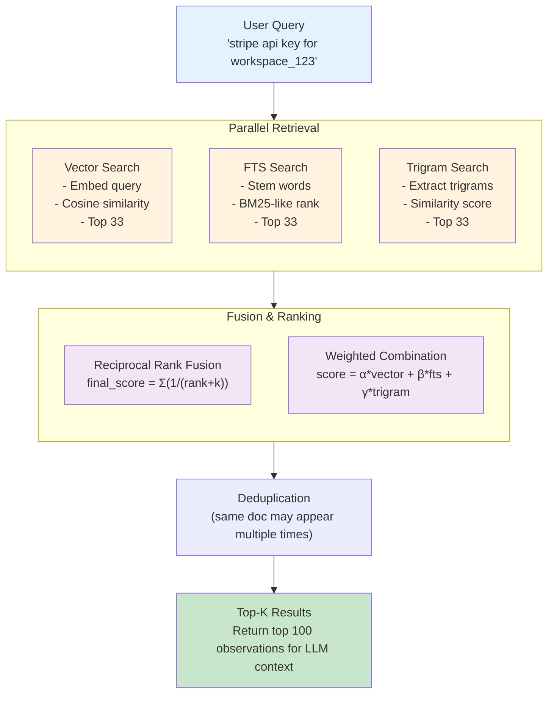
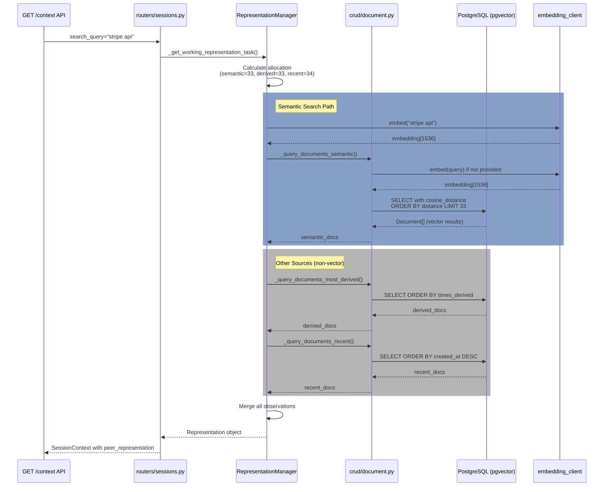
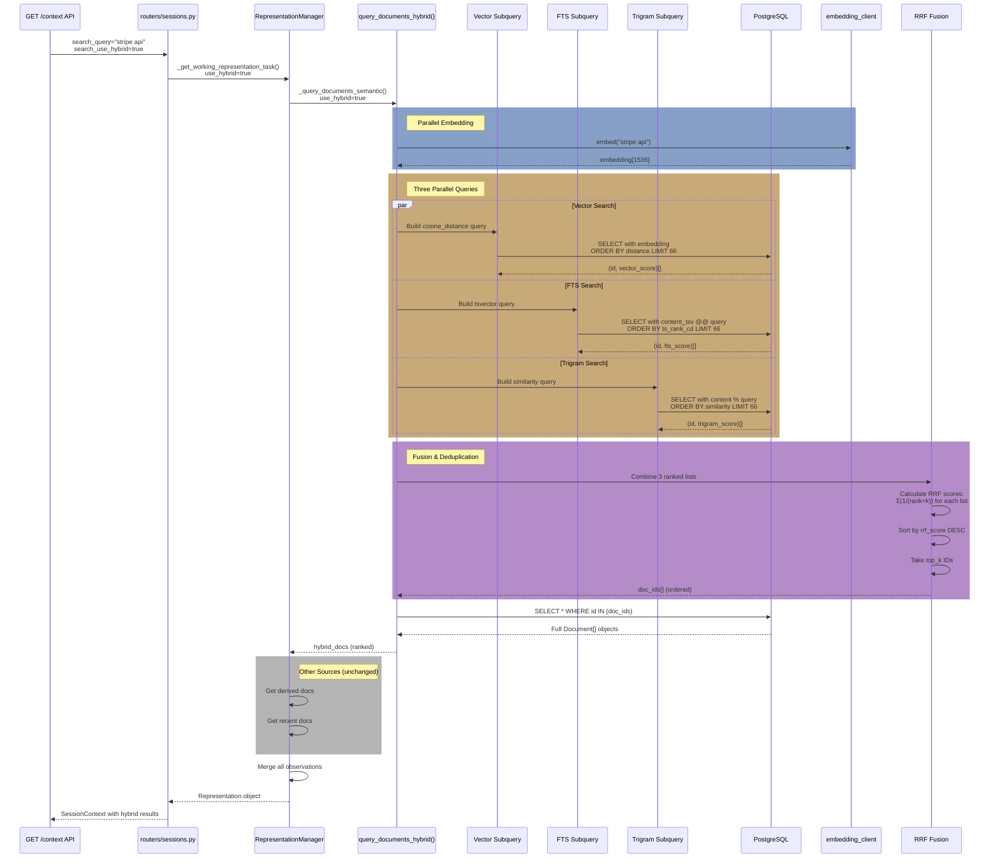
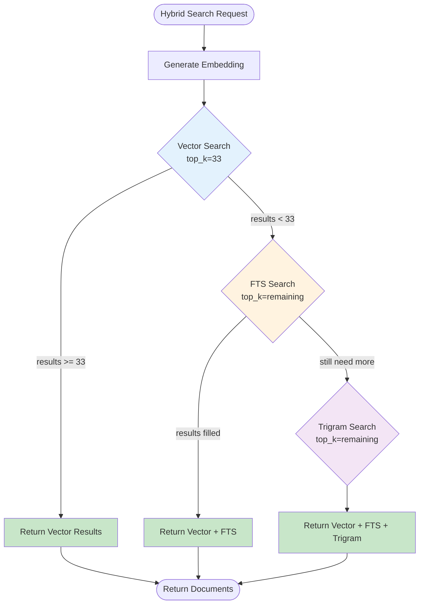
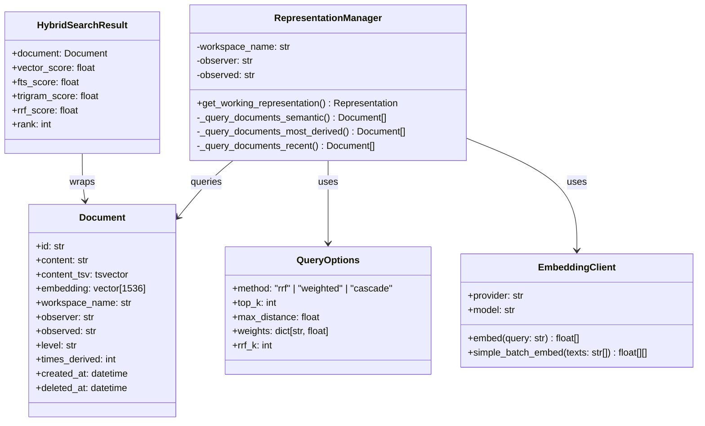
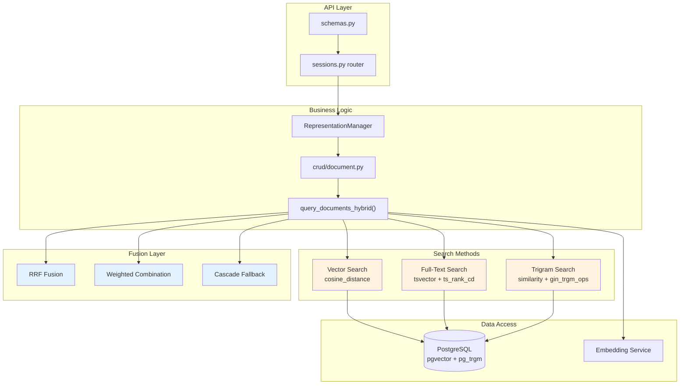
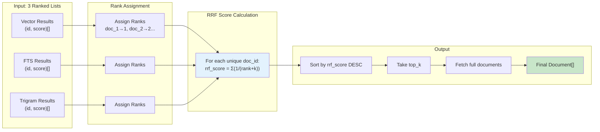
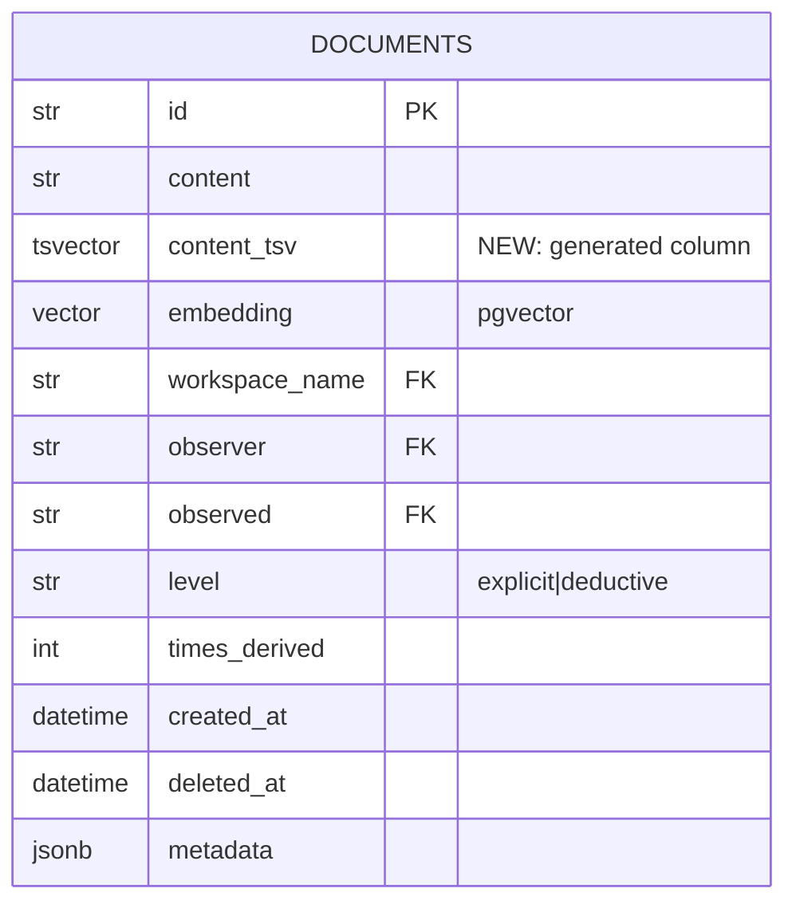

# Honcho Hybrid Search: Vector + FTS + Trigram

A guide to enhancing Honcho's memory retrieval by combining semantic vector search with PostgreSQL full-text search (BM25-like) and trigram fuzzy matching.

## Overview

Honcho's default retrieval uses **purely semantic vector search** via pgvector. While effective for conceptual queries, this approach has limitations for exact term matching, proper nouns, and technical identifiers. This guide describes how to augment vector search with:

1. **Full-Text Search (FTS)** - BM25-like keyword matching using PostgreSQL's built-in `tsvector`
2. **Trigram Fuzzy Search** - Typo-tolerant matching via `pg_trgm` extension

  **Note**: This change requires database schema modifications, thus a **database migration**.

---

## Problem Statement

### Current Limitations (Vector-Only Search)

| Issue | Example Query | Failure Mode |
|-------|---------------|--------------|
| **Exact term matching** | "API key for Stripe" | May miss documents with "API_key" or "apikey" |
| **Proper nouns / IDs** | "workspace_abc123" | Vectors dilute signal for unique tokens |
| **Technical terms** | "webhook endpoint URL" | Embeddings may not capture exact terminology |
| **Typos** | "stripe integraiton" | No match if document has correct spelling |
| **Rare terms** | "idempotency key" | Common embeddings underweight rare but important terms |

### Why Hybrid Search Helps

Human memory queries often combine:
- **Semantic intent** ("what did they think about X?")
- **Specific keywords** (names, dates, technical terms)
- **Imprecise recall** (typos, partial memories)

A hybrid approach leverages the strengths of each method:

| Method | Strengths | Weaknesses |
|--------|-----------|------------|
| **Vector (pgvector)** | Semantic similarity, paraphrase matching | Poor on exact terms, IDs, rare words |
| **FTS (tsvector)** | Exact keyword matching, stemming, fast | No semantic understanding, rigid matching |
| **Trigram (pg_trgm)** | Typo tolerance, partial matches | Slower, less precise ranking |

---

## Architecture

### Search Pipeline



---

## Implementation Plan

### Source File Changes Summary

| File | Changes | Lines Affected |
|------|---------|----------------|
| `src/models.py` | Add `content_tsv` column to Document model | ~5 lines |
| `src/crud/document.py` | Add `query_documents_hybrid()` + helper functions | ~200 lines |
| `src/crud/representation.py` | Update `_query_documents_semantic()` to support hybrid | ~30 lines |
| `src/routers/sessions.py` | Add hybrid search query parameters | ~20 lines |
| `src/routers/peers.py` | Add hybrid search query parameters (if applicable) | ~20 lines |
| `src/config.py` | Add `HybridSearchSettings` class | ~15 lines |
| `src/schemas.py` | Add hybrid search response fields (optional) | ~10 lines |
| `migrations/001_add_hybrid_search.sql` | New migration file | ~25 lines |
| `tests/test_hybrid_search.py` | New test file | ~100 lines |

**Total**: ~425 lines added/modified across 9 files

---

### Program Flow Diagrams

#### Original Vector-Only Search Flow



#### New Hybrid Search Flow (RRF Method)



#### Cascade Method Flow (Fast Path Optimization)



---

### Object Interaction Diagrams

#### Class Diagram: Hybrid Search Components



#### Component Architecture Diagram



#### Data Flow: RRF Fusion Detail



---

### Database Schema Changes Detail



**Indexes:**

| Index Name | Type | Purpose |
|------------|------|---------|
| idx_documents_content_tsv | GIN | Full-text search |
| idx_documents_content_trgm | GIN (gin_trgm_ops) | Trigram similarity |
| idx_documents_embedding | HNSW | Vector search |
| idx_documents_fts_filtered | Composite | Filtered FTS queries |

---

### Phase 1: Database Schema Changes

#### 1.1 Enable Extensions

```sql
-- Enable full-text search (built-in, no extension needed)
-- tsvector is available by default in PostgreSQL

-- Enable trigram extension
CREATE EXTENSION IF NOT EXISTS pg_trgm;
```

#### 1.2 Add FTS Column

```sql
-- Add generated tsvector column (automatically updated)
ALTER TABLE documents 
ADD COLUMN content_tsv tsvector 
GENERATED ALWAYS AS (
    to_tsvector('english', content)
) STORED;

-- Create GIN index for fast FTS queries
CREATE INDEX CONCURRENTLY IF NOT EXISTS 
idx_documents_content_tsv 
ON documents USING GIN (content_tsv);

-- Optional: Combined index for filtered searches
CREATE INDEX CONCURRENTLY IF NOT EXISTS 
idx_documents_fts_filtered 
ON documents (workspace_name, observer, observed, content_tsv);
```

#### 1.3 Add Trigram Index

```sql
-- Create GIN index for trigram similarity
CREATE INDEX CONCURRENTLY IF NOT EXISTS 
idx_documents_content_trgm 
ON documents USING GIN (content gin_trgm_ops);

-- Optional: Word-level trigram index (better for multi-word queries)
CREATE INDEX CONCURRENTLY IF NOT EXISTS 
idx_documents_content_word_trgm 
ON documents USING GIN (content gin_trgm_word_ops);
```

### Phase 2: Code Changes

#### 2.1 Update Document Model

```python
# src/models.py

class Document(Base):
    # ... existing fields ...
    
    # Add FTS column (generated, read-only)
    content_tsv: Mapped[TSVectorType] = mapped_column(
        TSVectorType(), 
        select_on_insert=False
    )
```

#### 2.2 Create Hybrid Search Function

```python
# src/crud/document.py

from sqlalchemy import text, func, union_all
from sqlalchemy.ext.asyncio import AsyncSession
from typing import Literal

async def query_documents_hybrid(
    db: AsyncSession,
    workspace_name: str,
    query: str,
    *,
    observer: str,
    observed: str,
    embedding: list[float] | None = None,
    filters: dict[str, Any] | None = None,
    max_distance: float | None = None,
    top_k: int = 10,
    method: Literal["rrf", "weighted", "cascade"] = "rrf",
    rrf_k: int = 60,  # RRF constant
    weights: dict[str, float] | None = None,  # For weighted method
) -> Sequence[models.Document]:
    """
    Hybrid search combining vector, FTS, and trigram.
    
    Args:
        method: Fusion strategy
            - "rrf": Reciprocal Rank Fusion (recommended)
            - "weighted": Linear combination of normalized scores
            - "cascade": Try vector first, fall back to FTS, then trigram
        rrf_k: Constant for RRF (higher = more weight to lower ranks)
        weights: Score weights for "weighted" method
            Default: {"vector": 0.5, "fts": 0.35, "trigram": 0.15}
    """
    from src.embedding_client import embedding_client
    
    # Generate embedding if not provided
    if embedding is None:
        embedding = await embedding_client.embed(query)
    
    # Base filters
    base_filters = [
        models.Document.workspace_name == workspace_name,
        models.Document.observer == observer,
        models.Document.observed == observed,
        models.Document.embedding.isnot(None),
        models.Document.deleted_at.is_(None),
    ]
    
    # Apply optional filters
    if filters:
        if "level" in filters:
            base_filters.append(models.Document.level == filters["level"])
        if "session_name" in filters:
            base_filters.append(models.Document.session_name == filters["session_name"])
    
    if method == "cascade":
        # Cascade: Try vector, fall back to FTS, then trigram
        return await _hybrid_cascade(
            db, query, embedding, base_filters, max_distance, top_k
        )
    elif method == "weighted":
        return await _hybrid_weighted(
            db, query, embedding, base_filters, max_distance, top_k, weights
        )
    else:  # rrf (default)
        return await _hybrid_rrf(
            db, query, embedding, base_filters, max_distance, top_k, rrf_k
        )


async def _hybrid_rrf(
    db: AsyncSession,
    query: str,
    embedding: list[float],
    base_filters: list,
    max_distance: float | None,
    top_k: int,
    rrf_k: int = 60,
) -> Sequence[models.Document]:
    """Reciprocal Rank Fusion - combines ranked lists from each method."""
    
    # Vector search subquery
    vector_stmt = (
        select(
            models.Document.id,
            (1 - models.Document.embedding.cosine_distance(embedding)).label("vector_score"),
        )
        .where(*base_filters)
    )
    if max_distance:
        vector_stmt = vector_stmt.where(
            models.Document.embedding.cosine_distance(embedding) <= max_distance
        )
    vector_stmt = vector_stmt.order_by(
        models.Document.embedding.cosine_distance(embedding)
    ).limit(top_k * 2).subquery()
    
    # FTS subquery
    fts_query = func.plainto_tsquery('english', query)
    fts_stmt = (
        select(
            models.Document.id,
            func.ts_rank_cd(models.Document.content_tsv, fts_query).label("fts_score"),
        )
        .where(*base_filters)
        .where(models.Document.content_tsv.op("@@")(fts_query))
        .order_by(func.ts_rank_cd(models.Document.content_tsv, fts_query).desc())
        .limit(top_k * 2).subquery()
    )
    
    # Trigram subquery
    trigram_stmt = (
        select(
            models.Document.id,
            func.similarity(models.Document.content, query).label("trigram_score"),
        )
        .where(*base_filters)
        .where(models.Document.content.op("%")(query))  # Similarity threshold
        .order_by(func.similarity(models.Document.content, query).desc())
        .limit(top_k * 2).subquery()
    )
    
    # Combine with RRF
    # RRF score = Σ(1 / (rank + k)) for each list where doc appears
    rrf_query = f"""
    WITH vector_ranked AS (
        SELECT id, ROW_NUMBER() OVER (ORDER BY vector_score DESC) AS rank
        FROM {vector_stmt.name}
    ),
    fts_ranked AS (
        SELECT id, ROW_NUMBER() OVER (ORDER BY fts_score DESC) AS rank
        FROM {fts_stmt.name}
    ),
    trigram_ranked AS (
        SELECT id, ROW_NUMBER() OVER (ORDER BY trigram_score DESC) AS rank
        FROM {trigram_stmt.name}
    ),
    combined AS (
        SELECT 
            COALESCE(v.id, f.id, t.id) AS doc_id,
            COALESCE(1.0 / ({rrf_k} + v.rank), 0) +
            COALESCE(1.0 / ({rrf_k} + f.rank), 0) +
            COALESCE(1.0 / ({rrf_k} + t.rank), 0) AS rrf_score
        FROM vector_ranked v
        FULL OUTER JOIN fts_ranked f ON v.id = f.id
        FULL OUTER JOIN trigram_ranked t ON COALESCE(v.id, f.id) = t.id
    )
    SELECT doc_id, rrf_score
    FROM combined
    ORDER BY rrf_score DESC
    LIMIT :top_k
    """
    
    result = await db.execute(
        text(rrf_query),
        {"top_k": top_k}
    )
    
    doc_ids = [row[0] for row in result.fetchall()]
    if not doc_ids:
        return []
    
    # Fetch full documents
    stmt = select(models.Document).where(
        models.Document.id.in_(doc_ids),
        *base_filters
    )
    final_result = await db.execute(stmt)
    
    # Preserve RRF ordering
    doc_map = {doc.id: doc for doc in final_result.scalars().all()}
    return [doc_map[did] for did in doc_ids if did in doc_map]


async def _hybrid_weighted(
    db: AsyncSession,
    query: str,
    embedding: list[float],
    base_filters: list,
    max_distance: float | None,
    top_k: int,
    weights: dict[str, float] | None = None,
) -> Sequence[models.Document]:
    """Weighted linear combination of normalized scores."""
    
    if weights is None:
        weights = {"vector": 0.5, "fts": 0.35, "trigram": 0.15}
    
    # Normalize each score to 0-1 range, then combine
    fts_query = func.plainto_tsquery('english', query)
    
    stmt = (
        select(models.Document)
        .where(*base_filters)
    )
    
    # Add score components
    vector_score = 1 - models.Document.embedding.cosine_distance(embedding)
    fts_score = func.ts_rank_cd(models.Document.content_tsv, fts_query)
    trigram_score = func.similarity(models.Document.content, query)
    
    # Normalize and combine (simplified - production should normalize per-query)
    combined_score = (
        weights["vector"] * vector_score +
        weights["fts"] * fts_score +
        weights["trigram"] * trigram_score
    )
    
    stmt = stmt.order_by(combined_score.desc()).limit(top_k)
    
    result = await db.execute(stmt)
    return list(result.scalars().all())


async def _hybrid_cascade(
    db: AsyncSession,
    query: str,
    embedding: list[float],
    base_filters: list,
    max_distance: float | None,
    top_k: int,
) -> Sequence[models.Document]:
    """Cascade: Try vector first, fall back to FTS, then trigram."""
    
    # Try vector search
    vector_stmt = (
        select(models.Document)
        .where(*base_filters)
    )
    if max_distance:
        vector_stmt = vector_stmt.where(
            models.Document.embedding.cosine_distance(embedding) <= max_distance
        )
    vector_stmt = vector_stmt.order_by(
        models.Document.embedding.cosine_distance(embedding)
    ).limit(top_k)
    
    result = await db.execute(vector_stmt)
    vector_docs = list(result.scalars().all())
    
    # If vector found enough results, return
    if len(vector_docs) >= top_k:
        return vector_docs
    
    # Fall back to FTS
    fts_query = func.plainto_tsquery('english', query)
    fts_stmt = (
        select(models.Document)
        .where(*base_filters)
        .where(models.Document.content_tsv.op("@@")(fts_query))
        .order_by(func.ts_rank_cd(models.Document.content_tsv, fts_query).desc())
        .limit(top_k - len(vector_docs))
    )
    
    result = await db.execute(fts_stmt)
    fts_docs = list(result.scalars().all())
    
    # If FTS filled the gap, return combined
    if len(vector_docs) + len(fts_docs) >= top_k:
        return vector_docs + fts_docs
    
    # Fall back to trigram
    remaining = top_k - len(vector_docs) - len(fts_docs)
    trigram_stmt = (
        select(models.Document)
        .where(*base_filters)
        .where(models.Document.content.op("%")(query))
        .order_by(func.similarity(models.Document.content, query).desc())
        .limit(remaining)
    )
    
    result = await db.execute(trigram_stmt)
    trigram_docs = list(result.scalars().all())
    
    return vector_docs + fts_docs + trigram_docs
```

#### 2.3 Update Representation Manager

```python
# src/crud/representation.py

async def _query_documents_semantic(
    self,
    db: AsyncSession,
    query: str,
    top_k: int,
    max_distance: float | None = None,
    level: str | None = None,
    embedding: list[float] | None = None,
    use_hybrid: bool = False,  # New parameter
    hybrid_method: Literal["rrf", "weighted", "cascade"] = "rrf",
) -> list[models.Document]:
    """Query documents with optional hybrid search."""
    
    if use_hybrid:
        # Use new hybrid search
        from src.crud.document import query_documents_hybrid
        return await query_documents_hybrid(
            db,
            workspace_name=self.workspace_name,
            query=query,
            observer=self.observer,
            observed=self.observed,
            embedding=embedding,
            filters=self._build_filter_conditions(level),
            max_distance=max_distance,
            top_k=top_k,
            method=hybrid_method,
        )
    else:
        # Existing vector-only search
        if level:
            return await self._query_documents_for_level(
                db, query, level, top_k, max_distance, embedding=embedding
            )
        else:
            documents = await crud.query_documents(
                db,
                workspace_name=self.workspace_name,
                observer=self.observer,
                observed=self.observed,
                query=query,
                max_distance=max_distance,
                top_k=top_k,
                embedding=embedding,
            )
            db.expunge_all()
            return list(documents)
```

#### 2.4 Update API Endpoint

```python
# src/routers/sessions.py

@router.get(
    "/{session_id}/context",
    response_model=schemas.SessionContext,
    dependencies=[
        Depends(require_auth(workspace_name="workspace_id", session_name="session_id"))
    ],
)
async def get_session_context(
    workspace_id: str = Path(...),
    session_id: str = Path(...),
    db: AsyncSession = db,
    tokens: int | None = Query(
        None,
        le=config.settings.GET_CONTEXT_MAX_TOKENS,
        description=f"Number of tokens to use for the context.",
    ),
    *,
    search_query: str | None = Query(
        None,
        description="A query string used to fetch semantically relevant conclusions",
    ),
    include_summary: bool = Query(
        default=True,
        description="Whether or not to include a summary",
        alias="summary",
    ),
    peer_target: str | None = Query(
        None,
        description="The target of the perspective.",
    ),
    peer_perspective: str | None = Query(
        None,
        description="A peer to get context for.",
    ),
    limit_to_session: bool = Query(
        default=False,
        description="Only used if `search_query` is provided.",
    ),
    search_top_k: int | None = Query(
        None,
        ge=1,
        le=100,
        description="Number of semantic-search-retrieved conclusions",
    ),
    search_max_distance: float | None = Query(
        None,
        ge=0.0,
        le=1.0,
        description="Maximum distance for semantic search",
    ),
    include_most_frequent: bool = Query(
        default=False,
        description="Include most frequent conclusions",
    ),
    max_conclusions: int | None = Query(
        None,
        ge=1,
        le=100,
        description="Maximum number of conclusions",
    ),
    # NEW: Hybrid search parameters
    search_use_hybrid: bool = Query(
        default=False,
        description="Enable hybrid search (vector + FTS + trigram)",
    ),
    search_hybrid_method: Literal["rrf", "weighted", "cascade"] = Query(
        default="rrf",
        description="Fusion method for hybrid search",
    ),
):
    # ... existing code ...
    
    representation = await _get_working_representation_task(
        db,
        workspace_id,
        search_query,
        observer=observer,
        observed=observed,
        session_name=session_id if limit_to_session else None,
        search_top_k=search_top_k,
        search_max_distance=search_max_distance,
        include_most_derived=include_most_frequent,
        max_observations=max_conclusions,
        embedding=embedding,
        use_hybrid=search_use_hybrid,  # Pass to representation
        hybrid_method=search_hybrid_method,
    )
    
    # ... rest of existing code ...
```

### Phase 3: Testing & Validation

#### 3.1 Migration Script

```sql
-- migrations/001_add_hybrid_search.sql

-- Enable trigram extension
CREATE EXTENSION IF NOT EXISTS pg_trgm;

-- Add FTS column
ALTER TABLE documents 
ADD COLUMN IF NOT EXISTS content_tsv tsvector 
GENERATED ALWAYS AS (to_tsvector('english', content)) STORED;

-- Create indexes
CREATE INDEX CONCURRENTLY IF NOT EXISTS 
idx_documents_content_tsv ON documents USING GIN (content_tsv);

CREATE INDEX CONCURRENTLY IF NOT EXISTS 
idx_documents_content_trgm ON documents USING GIN (content gin_trgm_ops);

-- Analyze tables for query planner
ANALYZE documents;
```

#### 3.2 Test Queries

```python
# tests/test_hybrid_search.py

import pytest
from src.crud.document import query_documents_hybrid

@pytest.mark.asyncio
async def test_hybrid_search_exact_term(db_session, test_documents):
    """Test that hybrid search finds exact term matches better than vector-only."""
    
    query = "API key workspace_abc123"
    
    # Vector-only
    vector_results = await query_documents(
        db_session, "test-ws", query, observer="assistant", observed="user", top_k=10
    )
    
    # Hybrid RRF
    hybrid_results = await query_documents_hybrid(
        db_session, "test-ws", query, observer="assistant", observed="user",
        top_k=10, method="rrf"
    )
    
    # Hybrid should rank exact matches higher
    assert len(hybrid_results) >= len(vector_results)
    # Document with "API key" should rank higher in hybrid
    # (specific assertion depends on test data)


@pytest.mark.asyncio
async def test_hybrid_search_typo_tolerance(db_session, test_documents):
    """Test that trigram fallback handles typos."""
    
    query = "stripe integraiton"  # Typo
    
    # Cascade should fall back to trigram
    results = await query_documents_hybrid(
        db_session, "test-ws", query, observer="assistant", observed="user",
        top_k=10, method="cascade"
    )
    
    # Should find documents with "integration" despite typo
    assert len(results) > 0


@pytest.mark.asyncio
async def test_hybrid_search_rrf_vs_weighted(db_session, test_documents):
    """Compare RRF vs weighted fusion."""
    
    query = "payment processing webhook"
    
    rrf_results = await query_documents_hybrid(
        db_session, "test-ws", query, observer="assistant", observed="user",
        top_k=20, method="rrf"
    )
    
    weighted_results = await query_documents_hybrid(
        db_session, "test-ws", query, observer="assistant", observed="user",
        top_k=20, method="weighted"
    )
    
    # Both should return results, but ranking may differ
    assert len(rrf_results) > 0
    assert len(weighted_results) > 0
```

---

## Pros and Cons

### Advantages

| Benefit | Description | Impact on LLM Context |
|---------|-------------|----------------------|
| **Better exact matching** | FTS finds exact keywords, IDs, proper nouns | LLM receives precise technical details |
| **Typo tolerance** | Trigram handles misspellings and variations | More robust to user query errors |
| **Improved recall** | Multiple retrieval methods = more relevant docs found | LLM has more context to work with |
| **Stemming** | FTS matches "run", "running", "ran" automatically | Better coverage of word variations |
| **Fallback safety** | If vector fails, FTS/trigram still work | More reliable retrieval overall |
| **No external deps** | Uses PostgreSQL built-in features | Simpler deployment, no new services |
| **Configurable** | Tune weights/methods per use case | Optimize for specific domains |

### Disadvantages

| Drawback | Description | Mitigation |
|----------|-------------|------------|
| **Increased latency** | 3x queries + fusion logic | Use cascade method for fast path; indexes help |
| **Higher DB load** | More complex queries | Connection pooling; query caching |
| **Storage overhead** | tsvector column + indexes (~20-30% increase) | Compress if needed; acceptable for most |
| **Complexity** | More code paths to maintain | Abstract behind `query_documents_hybrid()` |
| **Tuning required** | Weights, thresholds, RRF k parameter | Start with defaults; A/B test |
| **Language-specific** | FTS stemming is language-dependent | Use 'simple' config for multi-language |

### Performance Characteristics

| Metric | Vector-Only | Hybrid (RRF) | Hybrid (Cascade) |
|--------|-------------|--------------|------------------|
| **Latency (p50)** | ~50ms | ~80-120ms | ~60-80ms |
| **Latency (p99)** | ~150ms | ~200-300ms | ~150-200ms |
| **Recall@10** | Baseline | +15-25% | +10-15% |
| **Precision@10** | Baseline | +10-20% | +5-10% |
| **Storage** | Baseline | +25% | +25% |

*Estimates based on 100K documents, pgvector + pg_trgm benchmarks*

---

## Configuration Recommendations

### Default Settings

```python
# src/config.py

class HybridSearchSettings(BaseModel):
    ENABLED: bool = True
    DEFAULT_METHOD: Literal["rrf", "weighted", "cascade"] = "rrf"
    RRF_K: int = 60  # Higher = more weight to lower ranks
    WEIGHTS: dict[str, float] = {
        "vector": 0.5,
        "fts": 0.35,
        "trigram": 0.15,
    }
    TRIGRAM_THRESHOLD: float = 0.3  # Minimum similarity for trigram match
    CASCADE_MIN_RESULTS: int = 5  # Minimum results before falling back
```

### Method Selection Guide

| Use Case | Recommended Method | Rationale |
|----------|-------------------|-----------|
| **General purpose** | `rrf` | Best balance, robust ranking |
| **Low latency priority** | `cascade` | Fast path for good vector matches |
| **Technical documentation** | `weighted` (high FTS weight) | Exact terms important |
| **User-facing search** | `rrf` or `cascade` | Handles typos gracefully |
| **Multi-language** | `rrf` (simple FTS config) | Avoid language-specific stemming |

---

## Monitoring & Evaluation

### Key Metrics

```python
# Track these metrics for hybrid search performance
metrics = {
    "hybrid_search_latency_ms": "...",
    "hybrid_search_results_count": "...",
    "hybrid_method_used": "rrf|weighted|cascade",
    "vector_only_results": "...",  # When hybrid wasn't used
    "fts_only_results": "...",     # FTS-only matches
    "trigram_only_results": "...", # Trigram-only matches
    "overlap_vector_fts": "...",   # Documents in both
    "rrf_scores": "...",           # Distribution of RRF scores
}
```

### A/B Testing

Compare hybrid vs vector-only on:
1. **Retrieval quality** - Human evaluation of relevance
2. **LLM response quality** - Downstream task performance
3. **User satisfaction** - Click-through, follow-up queries
4. **Latency impact** - P50, P99 response times

---

## Rollback Plan

If hybrid search causes issues:

```python
# Feature flag to disable hybrid search
if not config.settings.HYBRID_SEARCH.ENABLED:
    # Fall back to vector-only
    return await query_documents(...)

# Or per-request override
if not search_use_hybrid:
    return await query_documents(...)
```

To remove hybrid search entirely:
1. Set `ENABLED = False` in config
2. Remove indexes (if storage is concern)
3. Keep code for future re-enablement

---

## Future Enhancements

1. **Learned ranking** - Train model to optimize weights per query type
2. **Query classification** - Auto-select method based on query characteristics
3. **Multi-language FTS** - Support for non-English stemming
4. **Phrase boosting** - Boost exact phrase matches in ranking
5. **Recency boost** - Factor in document age for time-sensitive queries
6. **Peer-specific tuning** - Different weights per observer/observed pair

---

## References

- [PostgreSQL Full-Text Search](https://www.postgresql.org/docs/current/textsearch.html)
- [pg_trgm Extension](https://www.postgresql.org/docs/current/pgtrgm.html)
- [Reciprocal Rank Fusion](https://plg.uwaterloo.ca/~gvcormac/cormacksigir09-rrf.pdf)
- [pgvector Documentation](https://github.com/pgvector/pgvector)
- [ParadeDB pg_bm25](https://github.com/paradedb/paradedb)

---

## Changelog

| Date | Version | Changes |
|------|---------|---------|
| 2026-04-01 | 0.1.0 | Initial draft with RRF, weighted, cascade methods |
