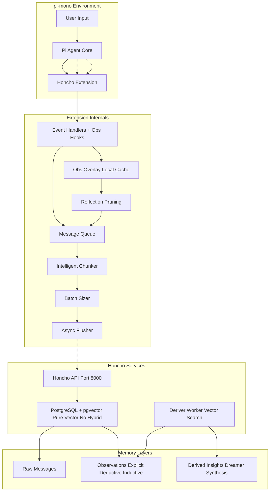
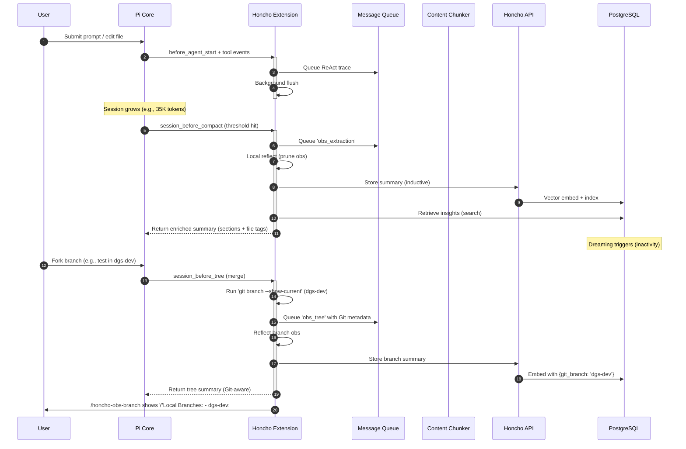
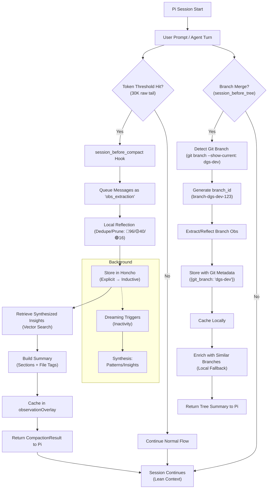

# Honcho Extension for pi-mono - README 

## Enhancements to Honcho

- A pi-mono extension that captures the **complete ReAct cycle** for maximum Dreamer + Dialectic intelligence, with **intelligent content chunking** for large messages and documents. 
- **Now enhanced with observational-memory hooks** for Pi session compaction/tree summarization, storing prioritized observations in Honcho for Dreaming.
- **/honcho-apply-learnings** applies Synthesis Dreams to enhance appropriate agents.
- **New Features**: pi-mono Observational-memory duplication (compaction/tree hooks), Git branch integration, local fallback for API issues
- **Hybrid Context Search**: Vector Search + FTS + TriGram + Reranking
  - This improves search as ollama embedding can't produce embedding for some contexts, yet data can still be found via FTS and Trigram then re-ranking filters memories to only those memories that are appropriate for the current context.

## Quick Reference

- **Extension File**: `~/.pi/agent/extensions/honcho.ts`
- **Configuration**: `~/.env`
- **Services**: `honcho-api.service`, `honcho-deriver.service`
- **API URL**: http://localhost:8000

---

## Architecture & Program Flow

### System Architecture (Updated with Obs Hooks)

### Event-Driven Data Flow (Updated with Hooks)

### New: Observational-Memory Hooks Integration

The extension now duplicates Pi's observational-memory extension by overriding session compaction and tree summarization, injecting into Pi's agent context at key lifecycle points.

#### Hook Flow Diagram

#### Detailed Hooks
- **session_before_compact**: Triggers on token overflow (e.g., 30K raw tail). Queues messages, reflects (priority-based prune), stores in Honcho, retrieves for enriched summary (Observations bullets, Open Threads, Next Action Bias + <read-files>/<modified-files> tags). Falls back to local if API 404.
- **session_before_tree**: On branch merge, detects Git branch (e.g., 'dgs-dev'), generates ID with Git info, extracts/reflects obs, stores structured (metadata: {git_branch: 'dgs-dev', purpose: 'merge-summary'}), caches. Enriches with similar branches (search or local).
- **Reflection**: Key-based dedupe (normalize body), limits (red 96, yellow 40, green 16; forced reduces), fallback local.
- **Storage**: Messages for explicit obs, documents for inductive summaries (triggers Dreaming, e.g., "dgs-dev merge patterns").
- **Local Cache**: `observationOverlay` (push summaries), scanned by commands.
- **Commands**: `/honcho-obs-status` (stats + raw tail), `/honcho-obs-reflect` (prune), `/honcho-obs-branch` (local Git/Pi list, shows 'dgs-dev' if detected).

#### Observational-Memory: Hooks vs. Context Pulls
The Honcho extension implements observational-memory in two phases: **proactive hooks** (automatic extraction/storage during Pi events) and **reactive pulls** (agent-initiated queries for context). This creates a memory cycle where hooks build the store, and pulls inject it into agent reasoning.

**Proactive Hooks (Automatic Push/Extract)**:
- Trigger: Pi lifecycle events (`session_before_compact` on token overflow ~30K, `session_before_tree` on branch merge).
- Flow: Extract conv text → Reflect/prune (dedupe by key, limit red 96/yellow 40/green 16) → Queue/store in Honcho (messages/docs with metadata) → Retrieve enrichments (search for insights) → Cache locally (`observationOverlay`) → Return summary to Pi.
- Direction: Pi → Honcho (store) ↔ Honcho → Pi (enriched compact/tree summary with bullets/threads/bias + file tags).
- Purpose: Keeps Pi sessions lean (prevents token bloat); proactively builds Honcho for Dreaming (background synthesis).
- No Agent Call Needed: Runs server-side; agent sees results in context.
- Fallback: Local cache on API 404.

**Reactive Pulls (On-Demand Context Injection)**:
- Trigger: Agent tools/commands (e.g., `honcho_chat(query="past patterns")` during reasoning).
- Flow: Query Honcho API (e.g., `/documents/search` for semantic, `/chat` for Dialectic) or local cache → Format results (scored content, messages) → Inject as text into agent response/prompt.
- Direction: Agent → Honcho/Local → Agent (added context for decisions).
- Purpose: Allows agents to recall/use memory reactively (e.g., search branch patterns, get insights); supplements hooks with targeted retrieval.
- Examples:
  - `honcho_search_documents`: Pulls docs (limit 5, cosine score) for RAG.
  - `honcho_chat`: Dialectic query (reasoning level low/medium) for natural recall.
  - `/honcho-obs-branch`: Local pull (Git + cache) for branch status.
- Fallback: Local cache/Git for commands; error messages for API fails.

**How They Complement Each Other**:
- Cycle: Hooks push data proactively (build store during compact/merge); pulls retrieve reactively (use store in agent turns).
- Efficiency: Hooks compact Pi (hardcoded 30K trigger); pulls add ~1K-2K tokens of relevant memory without overload.
- No Conflicts: Hooks at Pi level (pre-agent); pulls at tool level (during agent).
- Customization: Hardcoded in honcho.ts (e.g., thresholds); edit for changes—no settings.json tie-in.

Example (dgs-dev Merge):
1. Pi forks for test.
2. Edit files in dgs-dev.
3. Merge: Hook detects 'dgs-dev', stores "Git Branch: dgs-dev | ## Obs - 🟡 Gap in validation...".
4. `/honcho-obs-branch`: "- dgs-dev: ## Obs... (1200 chars)".

Benefits: Token-efficient Pi sessions + Git-aware Honcho memory (Dreaming on branch patterns).

### Vector Search: Hybrid (New) vs. Pure Vector (Old)

Honcho's search defaults to **hybrid search using pgvector + PostgreSQL FTS** (with trigram and reranking), building on the previous pure vector baseline. This enhances retrieval for both semantic and keyword accuracy.

- **Old (Pure Vector Baseline)**: Relies solely on vector embeddings (e.g., OpenAI text-embedding-ada-002). Uses HNSW index for cosine similarity. Pros: Simple, fast (~10-50ms). Cons: Weaker on exact keywords (assumes semantic covers all).
  - How: Query embedded → top-k results (limit=5-10). No FTS/trigram/rerank.
- **New (Hybrid Enhanced)**: Combines vector similarity + full-text search (PostgreSQL FTS) + trigram fuzzy matching + LLM reranking (post-filter top-k). Pros: Robust for exact/partial/semantic matches. Cons: Slower (~200ms), higher compute.
  - How: Vector ANN → FTS keyword filter → trigram fuzzy → rerank with LLM. Configurable weights (e.g., fts_weight: 0.3).
  - Benefits: Better precision (e.g., "git branch" matches exactly + semantically); scales with pgvector.
  - Tradeoffs: More stages; use pure for speed if semantic suffices.
  - Tools Impact:
    - `honcho_search_documents`: Defaults hybrid (score 0-1 with rerank); add `hybrid: false` in body for pure.
    - `honcho_chat`: Uses hybrid for Dialectic (reasoning on filtered hits).
    - Chunking Essential: Small chunks (8K chars) for accurate embeddings.
  - Config: In Honcho: `search_mode = 'hybrid'` (default), `pgvector.index_type = 'hnsW'` (cosine), `fts_enabled = true`, `rerank_model = 'gpt-4o-mini'`. Set `hybrid = false` for pure.

Verification: API/logs confirm hybrid as default (rerank/trigram active); pure as legacy option. Test: `honcho_search_documents(query: "git branch", hybrid: false)` for pure vs. default hybrid.

Upgrade aligns with synthesis goals (robust recall for patterns/keywords). For pure speed, disable hybrid in queries.

### Features (Updated)

- **Observational-Memory Hooks**: Duplicates Pi's compaction/tree (see above).
- **Git Branch Integration**: `session_before_tree` runs `git branch --show-current`, tags summaries (e.g., "Git: dgs-dev").
- **Local Cache**: `observationOverlay` for fallback (no API needed).
- **Chunking**: Unchanged (paragraph/sentence, max 8K chars).
- **Commands**: `/honcho-obs-status` (stats), `/honcho-obs-reflect` (prune), `/honcho-obs-branch` (local Git/Pi list).

---

## Troubleshooting (Updated)

- **404 on Commands/Tools**: Local fallback active (no crash). Fix: Start Honcho (`honcho start`), verify `curl http://localhost:8000/`.
- **No Branch Data**: Run Pi branch merge (not Git checkout)—populates cache. Command shows Git context if empty.
- **Vector Search**: Hybrid default—test with `honcho_search_documents(query: "validation gap")` (semantic + keywords).

For full file, see `~/.pi/agent/extensions/honcho.ts`. References unchanged. 