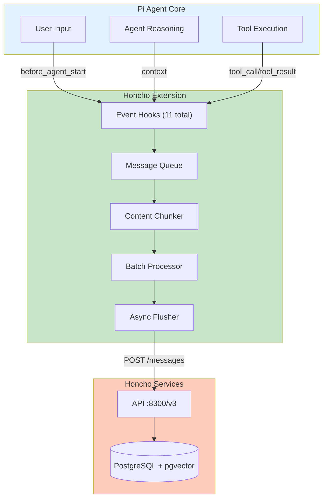
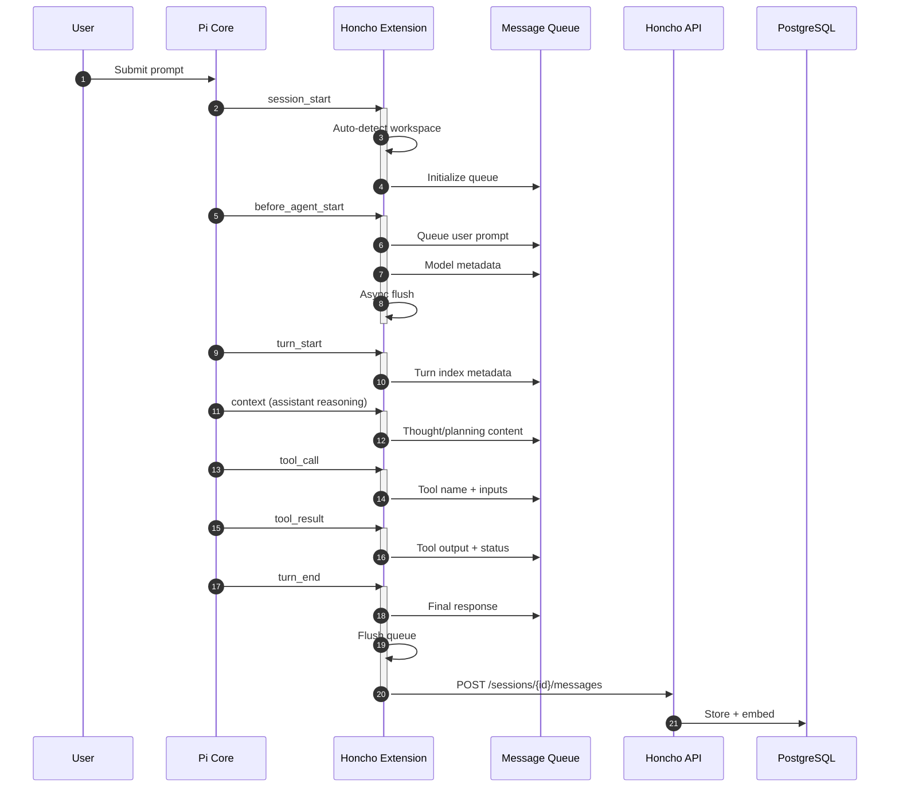
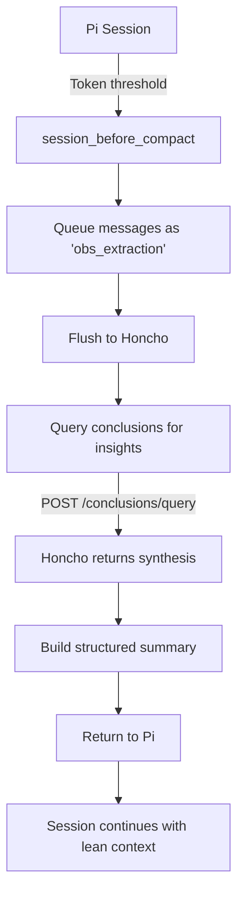
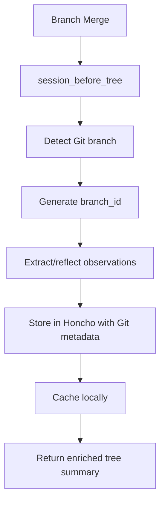

# Honcho Extension for pi-mono

A pi-mono extension that captures the **complete ReAct cycle** (prompts, thoughts, tool calls, observations, responses) for Dreamer + Dialectic intelligence. Features **intelligent content chunking** for large messages and **observational-memory hooks** for session compaction and tree summarization.

## Quick Reference

| Item | Value |
|------|-------|
| Extension File | `~/.pi/agent/extensions/honcho.ts` |
| Configuration | `~/.env` or `~/.pi/honcho.json` |
| API Base URL | `http://localhost:8300` (default) |
| API Version | `/v3` |

## Architecture



## Event Flow



## Available Tools

| Tool | Description | Endpoint |
|------|-------------|----------|
| `honcho_store` | Store a message in Honcho | `POST /sessions/{id}/messages` |
| `honcho_chat` | Query Dialectic API | `POST /peers/{id}/chat` |
| `honcho_list_documents` | List conclusions | `POST /conclusions/list` |
| `honcho_search_documents` | Semantic search | `POST /conclusions/query` |

## Event Hooks

The extension registers 11 hooks to capture the full agent lifecycle:

### Lifecycle Hooks

| Hook | When Triggered | What It Captures |
|------|----------------|------------------|
| `session_start` | Pi session begins | Workspace auto-detection |
| `before_agent_start` | Agent starts | User prompt, model info |
| `turn_start` | New turn begins | Turn index |
| `context` | Assistant messages | Thoughts/reasoning |
| `tool_call` | Tool invoked | Tool name, inputs |
| `tool_result` | Tool completes | Output, status, errors |
| `turn_end` | Turn completes | Final response |
| `agent_end` | Agent finishes | Cleanup flush |
| `session_shutdown` | Session ends | Final cleanup |

### Observational Memory Hooks

| Hook | When Triggered | Purpose |
|------|----------------|---------|
| `session_before_compact` | Token threshold hit (~30K) | Compaction with Honcho insights |
| `session_before_tree` | Branch merge | Tree summarization |

## Data Flow

### Message Queue → Honcho

```
Hook Event
    ↓
queueMessage(content, peer_id, metadata)
    ↓
Message Queue (in-memory)
    ↓
flushMessages() → Async batch send
    ↓
POST /v3/workspaces/{ws}/sessions/{id}/messages
    ↓
Honcho processes → PostgreSQL + embedding
```

### Chunking Strategy

Content >4000 chars is intelligently chunked:

1. **Paragraph boundaries** preferred (split on `\n\n`)
2. **Sentence boundaries** for oversized paragraphs
3. **Fixed length** as final fallback
4. **Metadata tracking**: `is_chunk`, `chunk_index`, `total_chunks`

### Batch Processing

- **Max batch size**: 5 messages per request
- **Inter-batch delay**: 50ms to avoid overwhelming server
- **Retry logic**: Failed messages requeued to messageQueue
- **Logging**: File logging to `/tmp/honcho.log` (with buffer)

## Configuration

### Environment Variables

| Variable | Default | Description |
|----------|---------|-------------|
| `HONCHO_BASE_URL` | `http://localhost:8300` | API base URL |
| `HONCHO_USER` | `dsidlo` | User peer ID |
| `HONCHO_AGENT_ID` | `agent-pi-mono` | Agent peer ID |
| `HONCHO_WORKSPACE_MODE` | `auto` | `auto` (detect from Git) or `static` |
| `HONCHO_WORKSPACE` | `default` | Workspace name (used if mode=static) |

### Configuration File

Searches for `honcho.json` in order:
1. `./honcho.json` (current directory)
2. `~/.pi/honcho.json`
3. `~/.config/pi/honcho.json`
4. `~/.honcho.json`

Example:
```json
{
  "honcho": {
    "base_url": "http://localhost:8300",
    "user": "dsidlo",
    "agent_id": "agent-pi-mono",
    "workspace_mode": "auto",
    "workspace": "local-honcho"
  }
}
```

## Workspace Auto-Detection

When `HONCHO_WORKSPACE_MODE=auto`:

1. Detect Git repository from current working directory
2. Extract remote origin URL
3. Generate workspace name: `{dir-name}-{repo-name}`
4. Create workspace if it doesn't exist
5. Fallback to current directory name if no Git repo found

## Session Compaction Hook

### Trigger
When session exceeds ~30K tokens, Pi calls `session_before_compact`.

### Flow



### Summary Format

Returns Pi compaction with sections:

```markdown
## Observations
- [Insights from Honcho]

## Open Threads
- Recent files/messages

## Next Action Bias
1. Actions to prioritize

<read-files>
- /path/to/read/file.ts
</read-files>

<modified-files>
- /path/to/modified/file.ts
</modified-files>
```

## Session Tree Hook

### Trigger
When Pi merges session branches.

### Flow



## Message Types Captured

| Type | Source | Metadata |
|------|--------|----------|
| `prompt` | User input | `role: user`, `has_images`, `intended_model` |
| `thought` | Assistant reasoning | `type: thought`, `step: planning`, `model` |
| `tool_call` | Tool invocation | `tool`, `tool_call_id`, `model` |
| `observation` | Tool result | `tool`, `status`, `is_error`, `output_length` |
| `final` | Assistant response | `role: assistant`, `turn_index`, `model` |
| `obs_extraction` | Compaction data | `session_part: compact`, `type: obs_extraction` |
| `obs_tree` | Branch summary | `type: obs_tree`, `git_branch`, `session_id` |

## API Endpoints Used

| Endpoint | Method | Used By |
|----------|--------|---------|
| `/v3/workspaces` | POST | `ensureWorkspaceExists()` |
| `/v3/workspaces/{ws}/sessions` | POST | `getOrCreateSession()` |
| `/v3/workspaces/{ws}/sessions/{id}/messages` | POST | `flushMessages()` |
| `/v3/workspaces/{ws}/peers/{id}/chat` | POST | `honcho_chat` tool |
| `/v3/workspaces/{ws}/conclusions/list` | POST | `honcho_list_documents` tool |
| `/v3/workspaces/{ws}/conclusions/query` | POST | `honcho_search_documents` tool, compaction hook |

## Key Functions

### Logging
- `honchoLog(level, msg, data?)` - Buffered file logging to `/tmp/honcho.log`
- `flushHonchoLog()` - Async log file flush

### Configuration
- `loadConfigFile()` - Load honcho.json configuration
- `getBaseUrl()` - Resolve API URL from env/config
- `detectWorkspaceFromContext(ctx)` - Git-based workspace detection

### Session Management
- `getOrCreateSession()` - Create or reuse session per workspace
- `ensureWorkspaceExists(name)` - Create workspace if missing
- `honchoFetch(path, options)` - JSON API client with error handling

### Message Pipeline
- `queueMessage(content, peer_id, metadata?)` - Add to message queue
- `splitContentIntoChunks(content, maxSize)` - Intelligent chunking
- `prepareMessageBatches(messages)` - Batch + chunk preparation
- `flushMessages()` - Send queued messages to Honcho

### Compaction Helpers
- `reflectObservations(content, mode)` - Deduplication/pruning
- `formatFileOperations(read, modified)` - Generate XML tags

## Error Handling

| Error Type | Behavior |
|------------|----------|
| API 404 | Log warning, use local cache |
| Network failure | Requeue messages for retry |
| Session creation fails | Skip flush, log error |
| Workspace creation fails | Fallback to `default` |

## Debugging

View logs:
```bash
tail -f /tmp/honcho.log
```

Log format:
```
[2024-04-11T04:16:51] [DEBUG] queueMessage | data={"peer_id":"agent-pi-mono","type":"prompt","queueLength":1}
[2024-04-11T04:16:51] [INFO] flushMessages: complete | data={"successCount":3,"failCount":0,"requeued":0}
```

## Extension Unload/Reload

On extension reload or pi shutdown:

1. `session_shutdown` hook triggered
2. Final `flushMessages()` attempt
3. Process stdin closed
4. Extension cleanup (pending requests cleared)

## Limitations

- **Document upload**: Not implemented (use conclusions via `honcho_store` instead)
- **Hybrid search**: Using pure vector search (no FTS integration)
- **MCP tools**: Not exposed through this extension
- **Webhooks**: Not currently used

## Related Files

| File | Purpose |
|------|---------|
| `honcho.ts` | Main extension (763 lines) |
| `README-honcho.md` | This documentation |
| `simpa.ts` | Prompt refinement extension (optional) |

---

Last updated: 2026-04-11 (matches honcho.ts version)